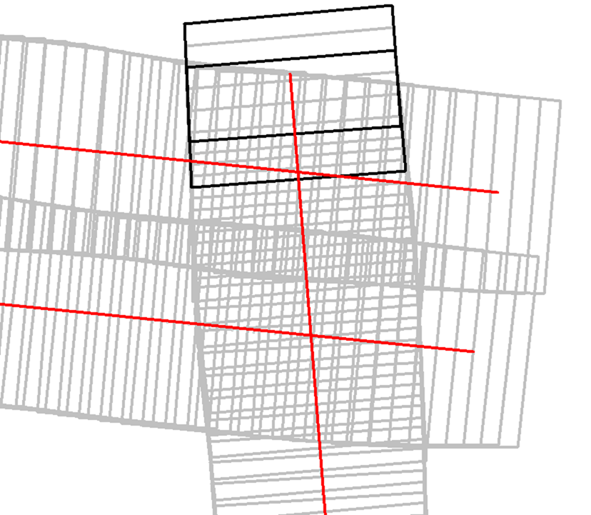
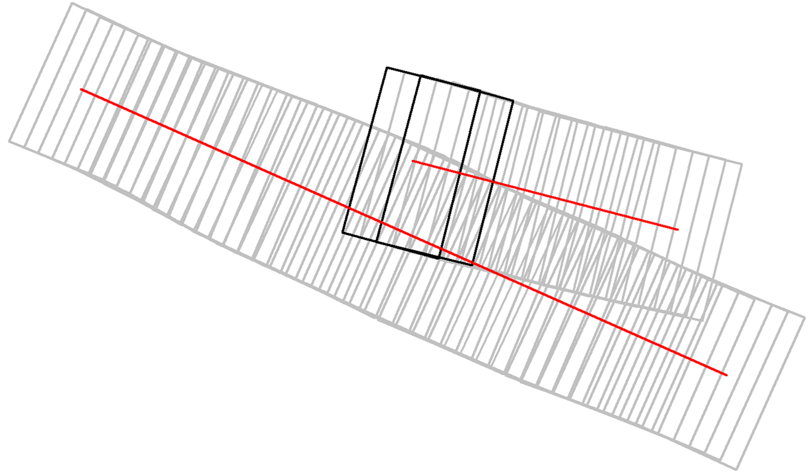
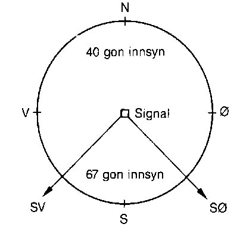
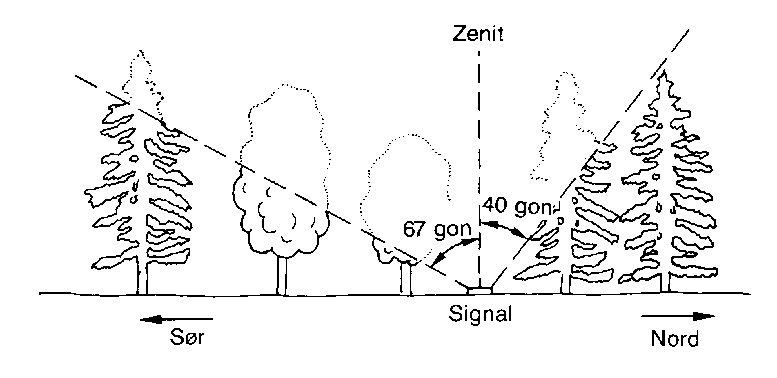
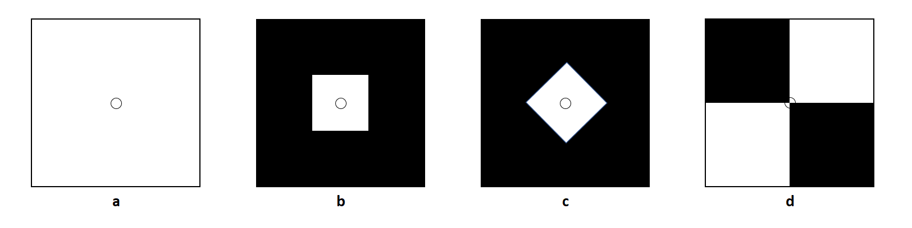
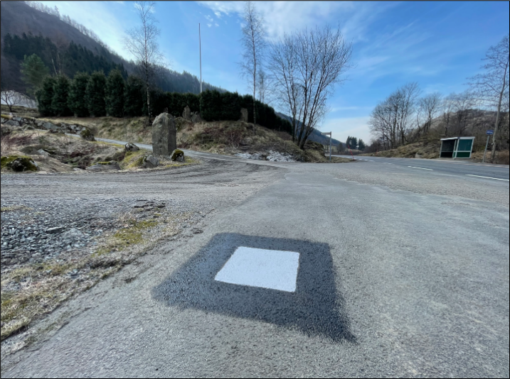
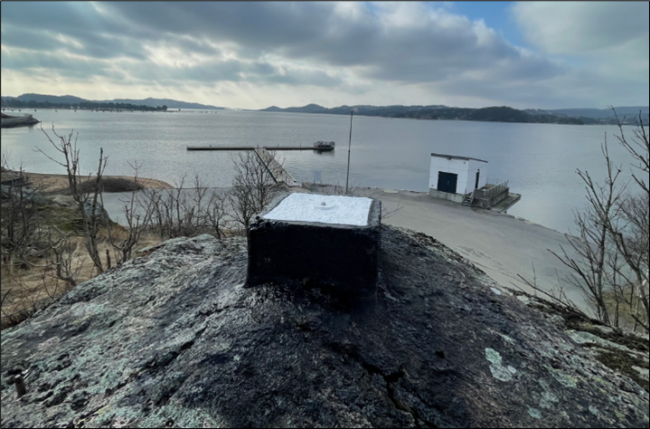
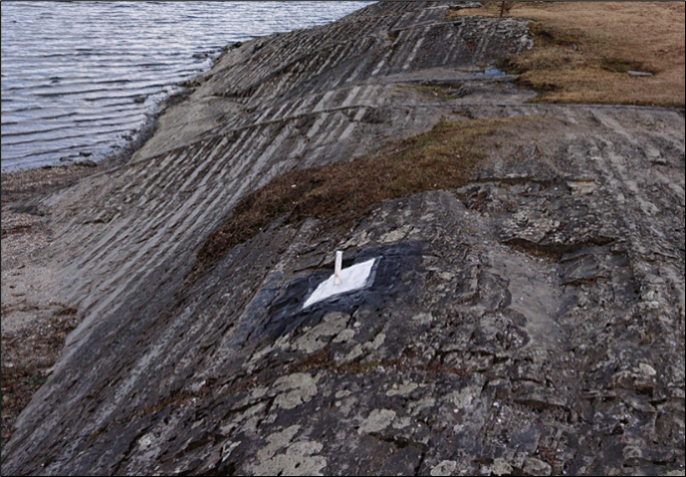

:stem:

[[kapittel-kartlegging-med-fotogrammetri]]
== Kartlegging med fotogrammetri

Dette kapittelet angir krav og retningslinjer for følgende arbeider:

* Fremstilling av grunnlaget for fotogrammetrisk kartlegging; herunder fly- og signalplanlegging, kalibrering og vedlikehold av kamera og instrumenter, signalering, flyfotografering og aerotriangulering.
* Fremstilling av produkter ved hjelp av fotogrammetri; herunder kartkonstruksjon, bildematching for høydemodellering og ortofotoproduksjon.

Kapittelet avgrenses til å gjelde følgende:

* Bruk av digitalt vertikalbildekamera.
* Bruk av GNSS/INS-støttet fotografering.
* Bruk av digital fotogrammetrisk arbeidsstasjon / ren programvarebasert produktfremstilling.
* Fremstilling av produkter definert i <<FKB>> og <<POF>>

[[kapittel-fly-og-signalplanlegging]]
=== Fly- og signalplanlegging

Dette avsnittet angir krav og retningslinjer til planlegging av flyfotografering, kjentpunkter for aerotriangulering og signalering av disse. Oppdragstaker skal utføre planleggingen og det skal utarbeides en kombinert fly- og signalplan.

==== Bildekvalitet

En viktig faktor ved fotografering fra luften er bildekvalitet. Det er en rekke faktorer som er med på å påvirke vår opplevelse av bildekvalitet. Hva som er bra kvalitet vil bestemmes av bruken av bildene. Dersom bildene skal brukes av maskin er informasjonsmengden i bilde viktig, men når menneske skal benytte bildene er det persepsjon som er viktigst. For de fleste tilfeller vil en balansegang mellom de to tilnærmingene være beste løsning. 

I kvalitetsmodellen kan vi knytte ulike bildekvalitetsmål til kategorien egenskapkvalitet - Kvantitativ egenskaps nøyaktighet. Noen vil også kunne havne under kategorien egenskapkvalitet - Ikke kvantitativ egenskapsriktighet.

I PABG har vi formalisert et rammeverk for å kvantifisere bildekvalitetsegenskapene oppløsning og fargenøyaktighet. Dette kan brukes som utgangspunkt for kravstilling i produktspesifikasjon eller bestillingdokumentene.

 
===== Oppløsning

Vi skiller mellom to ulike oppløsninger bakkeoppløsning eller "Ground sample distance" (GSD) og "Ground Resolved Distance" (GRD).

GSD er avstanden på bakken som tilsvarer en piksel i kameraet. GSD beregnes etter <<formel-GSD>>, hvor p er pikselstørrelsen i kameraets bildesensor, H er flyhøyden over bakken og f er kamerakonstanten til kameraet. 

[stem#formel-GSD, reftext=formel 1]
++++
\begin{equation}
GSD = \frac{p \cdot H}{f}
\end{equation}
++++

GRD beskriver den minste avstanden mellom to objekter på bakken som et kamera klarer å skille fra hverandre i bildet. Dersom avstanden blir mindre, vil objektene smelte sammen i bildet. Beregningene av GRD utføres etter fremgangsmåte beskrevet i *[Meißner and Berger, 2025]*.

For å beregne GRD må det anvendes en Siemens stjerne innenfor prosjektområdet. Dette er en sirkel bestående av like store svarte og hvite segmenter. Anbefalte antall segmenter s følger *[Meißner and Berger, 2025]* og bør ligge mellom 16 og 96 segmenter. Radiusen til stjernen beregnes etter <<formel-radius>>. Når <<formel-radius>> benyttes bør det etableres svart og hvite referanseflater som har en størrelse som sikrer helt svarte og helt hvite piksler. Dette benyttes i utregningene av GRD og styrker nøyaktigheten til beregningen.

[stem#formel-radius, reftext=formel 2]
++++
\begin{equation}
r = \frac{3 \cdot s \cdot GSD}{2\pi} + 0.1 \left( \frac{3 \cdot s \cdot GSD}{2\pi} \right)
\end{equation}
++++

===== Fargenøyaktighet

Fargenøyaktighet kan måles ved å måle fargen på naturlige eller kunstige fargereferanser innad i prosjektområdet. Fargereferansen bør ha en homogen farge, tilnærmet horisontal og ha en størrelse som sikrer 3x3 piksler som kun er påvirket av fargereferansens farge og ikke omliggende flater. For pansharpenings systemer med ratio 1:3 bør da fargereferanse ha en størrelse på 9x9 piksler. Tilsvarende for bayer pattern systemer bør størrelsen være 6x6 piksler. 

For å kunne benytte fargereferansene må fargen måles med et fargespektrometer. Det måles da med referanselyskilde og observasjonsvinkel definert av «International Commission on Illumination».  Referanselyskilden bør være D65 som tilsvarer sollyset midt på dagen med en fargetemperatur på ca 6504 kelvin og observasjonsvinkel bør være 10°. Observasjonsvinkelen refereres til øyets observasjonsvinkel. Målt farger og korresponderende fargereferanser i bildet sammenlignes i fargerommet CIELAB, hvor avstanden mellom dem beregnes. Denne avstanden kalles ofte ∆E.  Når ∆E verdien er under 1 er det vanskelig å se forskjell på fargene. Verdier over 2 er lett å se forskjell på.

//[[tabBildekvalitet]]
//.bildekvalitet
//[width="100%",options="header"]
//|====================
//| Kvalitetselement  | Beskrivelse | Kvalitetsmål
//| GSD |Bakkeoppløsning  | Innenfor krav.
//| GRD | Minste avstanden mellom to objekter.  |  Bør sammenfalle //med produktets krav til detaljrikdom. 
//| Fargenøyaktighet|  Naturtro farger.  |  Subjektiv vurdering.  

//|==================== 

==== Planlegging av flyfotografering (flyplan)

:xrefstyle: short

====
[#krav-foto-flyplanlegging,reftext="Krav foto flyplanlegging"]
*KRAV FOTO FLYPLANLEGGING*

* Flyplanleggingen skal utføres slik det er beskrevet i <<tab-flyplanlegging>>.

:xrefstyle: full

[[tab-flyplanlegging]]
.Krav til flyplanlegging
[width="100%",options="header"]
|====================
|Parameter|Krav
|GSD|GSD bestemmes av oppdragsgiver og velges slik at kravene til fullstendighet og nøyaktighet blir oppfylt. Se xref:tab-FKB-GSD[xrefstyle=short].
|Flyhøyde|Flyhøyden skal velges slik at kravet til GSD oppfylles for hver enkelt flystripe. Dersom annet ikke avtales skal GSD refereres til midlere terrenghøyde i hver stripe. Det tillates et planlagt avvik i GSD på maks. + 10 %. Eventuelle avvik fra dette skal avtales.
|Bildeblokk|Flystripene skal plasseres optimalt, slik at den resulterende bildeblokka får en mest mulig regulær form og flest mulig parallelt overlappende striper (for å sikre best mulig bildeorientering).
|Innsyn og sammenbinding|Flystripene skal plasseres, og overdekningen skal eventuelt økes, slik at det sikres best mulig innsyn i alle områder og god bilde- og stripesammenbinding i områder med mye vann.
|Sideoverdekning|Sideoverdekningen skal i gjennomsnitt ikke være mindre enn avtalt verdi. På høyeste punkt mellom stripene kan det planlegges ned til 5 % sideoverdekning. Lengre strekk med slik marginal sideoverdekning skal ikke forekomme.
|Lengdeoverdekning|Lengdeoverdekningen skal være avtalt verdi overalt i fotograferingsområdet. Det tillates kortere avvik +/- 5 prosentpoeng, som eksempel ved bestilt 80% overlapp tillates det inntil 75% eller 85% overlapp over kortere strekninger.
|Stereodekning på utsiden av prosjektområdet|For å sikre god stereodekning i hele prosjektområdet skal flystripene forlenges slik at det alltid tas ekstra bilder utenfor avtalt prosjektområde ved flystripestart og flystripeslutt, slik at det er minst en full 60% stereomodell ut over prosjektområdet. Normalt vil dette utgjøre 3-4 bilder. Det er ikke krav om en slik buffersone ut i vannområder. På langs av fotoretning skal stereodekning på utsiden av prosjektområdet dekke tilsvarende bestilt sideoverdekning. Ved fotografering av enkeltstriper settes krav til stereodekning på utsiden av prosjektområdet til minimum 10% av stripebredden.
|Overlapp kryssende striper|I bildeblokker med flere striperetninger skal striper med kryssende retning ha stereodekning over hele bredden til kryssende flystripe.
|Overlapp kjedede enkeltstriper|Kjedede enkeltstriper, dreid en vinkel i forhold til hverandre, skal overlappe hverandre med minimum to stereomodeller i hver stripe og med minimum 60% stereomodell over hele stripebredden. Det skal være tilstrekkelig med terreng for å kunne finne nok sammenbindingspunkter mellom stripene. I overlappsområdet mellom kryssende flystriper skal som hovedregel minimum 50% av overlapsområde være land.
|Plassering kjedede enkeltstriper|For vegkartlegging eller annen stripekartlegging skal det tilstrebes at vegen blir sentrisk i stripene. Dette skal likevel ikke hindre en hensiktsmessig flyplan og kravene til bildeorientering skal ivaretas
|Tverrstriper a| Tverrstriper skal fortrinnsvis ligge vinkelrett på flystripene. Tverrstriper har reduserte krav til sky og skyskygge så lenge normale flystriper med god kvalitet dekker området, men dekningen må være god nok til å lage en sammenhengende flystripe i aerotrianguleringen (krav til antall sammenbindingspunkt vil være gjeldene for tverrstriper).

I blokker med mer enn to flystriper og med mindre sideoverlapp enn 50%, så må et av disse to alternativene være dekket på alle flystripene i blokken:

* Alle stripene skal dekkes av minst en tverrstripe. Tverrstripen må ha en stereomodell som er over midten av flybildet i en hel 60% stereomodell. Se xref:imgTverrstripe2[xrefstyle=short]. 
* Alle flystriper må ha minst en stereomodell med 60% lengeoverlapp som dekker minimum 50% av bredden av flybildet fra en annen flystripe, i deler av flystripen. Se xref:imgTverrstripe1[xrefstyle=short].

Felles for begge alternativene er at det overlappende området skal ligge i et område egnet for etablering av sammenbindingspunkt. Det betyr at overlappsområdet for eksempel ikke bare skal inneholde vann. 

.Viser overlapp som er nødvendig for at stripen som går oppover skal være tverrstripe for de 2 andre flystripene. Stereomodellen som lages av de 2 svarte bildeomrissene krysser midten av flybildene i den øverste flystripen. Dermed er alternativ 2 oppfylt.
[#imgTverrstripe2]

.Viser flystriper som er tverrstriper for hverandre. Stereomodellen som lages av de 2 svarte bildeomrissene krysser midten av flybildene i stripen under. Dermed er alternativ 1 oppfylt.
[#imgTverrstripe1]

|====================
====

For å sikre best mulig bildeorientering og redusere behovet for kjentpunkter, skal delområder i rimelig nærhet av hverandre forbindes ved at flystripene forlenges.

==== Planlegging av kjentpunkt og signalering (signaleringsplan)
Signaleringsplan utarbeides av oppdragstaker som en integrert del av flyfotoplanleggingen og kjentpunktene planlegges slik at plasseringen blir optimal med hensyn til krav til antall, plassering og enkel adkomst. For krav til antall og plassering, se <<Krav til antall og plassering av kjentpunkter>>.

Signaleringen bør planlegges og utføres slik at fotograferingen kan starte opp så snart forholdene tillater det, eksempelvis ved at lavereliggende områder signaleres først.

===== Krav til kjentpunkter

====
[#krav-foto-kjentpunktnoyaktighet,reftext="Krav foto kjentpunktnøyaktighet"]
*KRAV FOTO KJENTPUNKTNØYAKTIGHET*

* Alle kjentpunkter skal måles inn med geodetiske metoder og beregnes (utjevnes) med kontroll mot grove feil i alle trinn.
* Kjentpunktene skal måles inn og bestemmes med et standardavvik maksimalt lik ¼ av det strengeste kravet til geodata i det aktuelle prosjektet. Eksempel for FKB kartlegging se xref:tab-nøyaktighet-innmåling-kjentpunkt-FKB[xrefstyle=short].
* Naturlige kjentpunkter kan benyttes unntaksvis, for eksempel for å erstatte tapte signaler i kritiske posisjoner. I prosjekter med høye nøyaktighetskrav skal da et veldefinert punkt først velges i bildene og deretter måles inn i marka. I prosjekter med lavere nøyaktighetskrav, som for eksempel Omløpsfotograferingen, kan eksisterende, antatt synlige geodetiske punkter (varder, fyrlykter, og lignende med tilfredsstillende oppgitt nøyaktighet) planlegges som supplement til de signalerte kjentpunktene for å oppnå bedre kontroll i utilgjengelige områder.
====

[[tab-nøyaktighet-innmåling-kjentpunkt-FKB]]
.Nøyaktighetskrav for innmåling av kjentpunkt i FKB
[cols="5*",options="header"]
|====================
|FKB-Standard
2+|Krav til geodata, svært veldefinert detalj (cm)
2+|Krav til markmåling av kjentpunkter (cm)
||S~p~|S~h~|S~p~|S~h~
|FKB-A|10|10|3|3    
|FKB-B|15|15|4|4    
|FKB-C|48|48|12|12    
|FKB-D|48|48|12|12    
|====================
Det presiseres at tallene i xref:tab-nøyaktighet-innmåling-kjentpunkt-FKB[xrefstyle=short] henviser til kravene som er stilt i FKB 5.0 produktspesifikasjonen, ved endringer i FKB spesifikasjonen vil eventuelle endringer til nøyaktighetskrav gjelde foran kravene som er satt opp i xref:tab-nøyaktighet-innmåling-kjentpunkt-FKB[xrefstyle=short]. Det stilles krav til henholdsvis punktstandardavvik, grunnriss (S~p~) og standardavvik i høyde (S~h~). For systematisk avvik skal dette for FKB være 1/3 av standardavvikskravet.

For øvrige krav til innmåling vises det til standarden <<SAT>>, og for krav til utførelse av signaleringen vises det til <<Signalering>>.

===== Krav til antall og plassering av kjentpunkter
Ved GNSS/INS-støttet fotografering kreves det i teorien kun et fåtall kjentpunkt for å kunne utføre AT. Kjentpunktene er kun nødvendige for å kunne bestemme systematiske avvik i de GNSS-bestemte projeksjonssentrene (datumstransformasjon), samt for å ha en minimums-kontroll. I praksis trengs vesentlig flere punkt for å kunne:

* Bestemme flere GNSS-skift på grunn av fotografering over flere dager.
* Dokumentere kvaliteten i bildeorienteringen tilstrekkelig/godt.
* Oppdage avvik i hele blokka.

====
[#krav-foto-kjentpunkt-antall-og-plassering,reftext="Krav foto kjentpunkt - Antall og plassering"]
*KRAV FOTO KJENTPUNKT - ANTALL OG PLASSERING*

* Det skal være minimum ett fullbestemt kjentpunkt i hver flystripe.
* Kravet til antall kjentpunkt kan avvikes etter avtale. Dette må da kompenseres med flere tverrstriper.
* I en bildeblokk skal det være minimum 5 fullbestemte kjentpunkter. Kravet gjelder også for enkeltstriper og enkeltstriper i kjede. Avvik fra dette (for eksempel ved svært små blokker og ved mange spredte øyer) kan tillates dersom oppdragsgiver har åpnet for dette i teknisk spesifikasjon for oppdraget. I slike tilfeller skal det sørges for at korrekte GNSS-skift blir påført bildene.
* I blokker som inneholder kjedede enkeltstriper skal det være minimum ett fullbestemt kjentpunkt i hvert overlappsområde mellom stripene, samt minimum ett i, eller nær, enden av hver kjede.
* Kjentpunktene skal fordeles jevnt over hele bildeblokka og det skal påses at det finnes kjentpunkter nær blokkas ytterkanter. Det er dog ikke nødvendig å plassere kjentpunktene helt i ytterkant, dersom for eksempel adkomst gjør dette vanskelig.
====

==== Krav til innhold og presentasjon av fly- og signalplanen

====
[#krav-foto-fly-og-signaleringsplan,reftext="Krav foto fly- og signaleringsplan"]
*KRAV FOTO FLY- OG SIGNALERINGSPLAN*

* Endelig fly- og signaleringsplan skal bestå av rapport i PDF-format, samt avgrensninger og kjentpunkt i avtalt vektorformat. Rapporten skal minimum inneholde: +
** Kamerafabrikat- og type, samt kamerakonstant. +
** GSD, samt flyhøyde over havnivå for hver stripe. +
** Lengde- og sideoverdekning i prosent. +
** Antall striper og bilder, samt totalt antall stripekilometer. +
** Omriss av bilde- eller stripedekning. +
** Planlagte kjentpunkter med navn og ulike farger el. som skiller nye og eksisterende punkter. +
** Estimert total effektiv flytid. Med effektiv flytid menes flytiden for å dekke prosjektområdet, (striper + svinger). Flytid til og fra prosjektområdet medregnes ikke. +
** Prosjektgrense og topografisk bakgrunnskart. +
** Dato for godkjenning av planen og navnet på planleggeren.
====

Eksempel på fly- og signaleringsplan finnes i <<Eksempel fly- og signaleringsplan (foto)>>.

[[kapittel-signalering]]
=== Signalering
Dette kapittelet angir krav og retningslinjer til signalering av kjentpunkter for aerotriangulering og eventuelle objekter som skal kartlegges og som er for små til å synes i flybildene. For innmåling av kjentpunkter henvises til krav i <<Krav til kjentpunkter>> og til standarden <<SAT>>.

==== Lovhjemmel for markarbeider - Matrikkellova
Tillatelse til utsetting av fastmerker og signaler og rydding for sikt ved offentlige kart- og oppmålingsarbeider er hjemlet i Matrikkellova, §41 _Rett til å utføre oppmålingsarbeid på offentleg og privat grunn._

Bestemmelsene i §43 om plikt til varsling av grunneiere og brukere skal ivaretas: _«Før oppmålingsarbeid blir sett i verk, skal alle som arbeidet vedkjem, få varsel på ein etter forholda formålstenlig måte. Departementet kan gi forskrift om varsling.»_.

Under målearbeider skal det utvises forsiktighet slik at arbeidet fører til minst mulig skade og ulempe for grunneier eller bruker.

Lovens § 49 gir strafferettslig beskyttelse for fastmerker og signaler oppsatt etter loven.

Plassering av fastmerker eller signal i eller på automatisk fredete kulturminner, eller innenfor et 5 m bredt belte regnet fra kulturminnets synlige ytterkant, er forbudt etter lov om kulturminner (Kulturminneloven §3 og §6).

==== Utføring av signalering
====
[#krav-foto-signalering,reftext="Krav foto signalering"]
*KRAV FOTO SIGNALERING*

* Signaleringsarbeidet skal utføres slik det er beskrevet i xref:tab-krav-signaleringsarbeid[xrefstyle=short].

:xrefstyle: short

[[tab-krav-signaleringsarbeid]]
.Krav til signaleringsarbeidet
[width="100%",options="header"]
|===
|Parameter|Krav
|Markering av nye kjentpunkt|Nye kjentpunkt skal markeres med bolt, spiker eller annen varig markering.
|Plassering av signal|Signalet plasseres på horisontalt flatt/plant underlag og skal som hovedregel males. Signal skal ikke plasseres på løse gjenstander som kumlokk. Prefabrikkerte signalplater skal ha sentrumshull og plasseres og festes slik at de ikke kommer ut av posisjon/horisontering eller blir ødelagt før fotografering. Sentrisk plassering skal være innenfor 1/3 av krav til markmåling av kjentpunkt se <<tab-nøyaktighet-innmåling-kjentpunkt-FKB>>. 
|Signalfarge|Signalfargen skal være matt hvit med matt svart kontrastfelt.
|Signalform og -størrelse|Signalet skal ha en regulær og symmetrisk form. Størrelsen skal avpasses etter bildeoppløsning (GSD). Krav til størrelser på signaler er vist i <<tab-krav-signalstørrelser>>, mens tillatte signaltyper er vist i <<#imgSignalutforming>>.
|Planhet for signal og kontrastområdet|Krav til flatt/plant underlag gjelder både signal og kontrastområdet. Høydevariasjon på signal og kontrastområdet målt fra senter av signal skal ikke overstige kravet til markmåling av kjentpunkt se <<tab-nøyaktighet-innmåling-kjentpunkt-FKB>>. Eksempler på egnede og ikke egnede signaler kan sees i <<#imgSignaler>>. Dersom det ikke er mulig å etablere signal som overholder krav til planhet i området hvor signalet må etableres, kan kravet om planhet til signal og kontrastområdet fravikes etter avtale med oppdragsgiver.
|Kontrast|Det skal sørges for god kontrast rundt signalet. Kontrastfeltet skal være minst halvparten av signalbredden (til hver side av signalet).
Fjell, stein, sand, grus, asfalt eller betong gir dårlig kontrast, og det skal da lages kunstig kontrast rundt signalet. Kontrastområdet skal være horisontalt flatt/plant og ha samme høyde som signalet.
|Bolthøyde|Høydeforskjellen mellom punktets høydereferanse og signalmidt skal alltid måles. Ved signalering av eksisterende punkter skal punktets høydereferanse observert i marka verifiseres mot den oppgitte og målt bolthøyde skal verifiseres mot oppgitt bolthøyde. Ved uoverensstemmelse eller dersom bolten er borte eller bøyd skal som hovedregel den oppgitte bolthøyden antas å være korrekt.
|Innsyn|Signalet skal være synlig i alle bildene/stripene som er planlagt å dekke punktet (for å sikre at det er synlig også i bilder/striper som eventuelt fotograferes på ulike datoer eller flysesjoner). Vegetasjon som kan hindre dette skal ryddes bort. Som tommelfingerregel kan benyttes at synslinjen fra et signal på marka til flyet skal gå på skrå med en vinkel på opptil 40 gon fra senit, se <<#imgInnsynSign>> og <<#imgInnsynSor>>.
|Skygge|Skygge på signalet skal unngås. De samlede retningslinjene til innsyn går fram av <<#imgInnsynSign>> og <<#imgInnsynSor>>. Det skal være godt innsyn til signalet hele veien rundt. For å unngå skygge på signalet skal det være innsyn ned til 67 gon fra vertikalen i en sektor mot sør. Retningslinjene forutsetter fotografering i det mest vanlige tidsrommet på dagen.
|Rydding av vegetasjon|Rydding av vegetasjon skal utføres med varsomhet. På privat grunn skal alltid grunneieren kontaktes før man går i gang med rydding.
|Erstatningspunkt|Dersom planlagt posisjon blir funnet å være ubrukelig på grunn av innsyn, eller lignende skal et nytt eller eksisterende punkt etableres så nær som mulig det opprinnelig planlagte.
|===
====

.Innsyn rundt signalet
[#imgInnsynSign]
//[caption="Figure 1:"]

.Innsyn mot sør
[#imgInnsynSor]
//[caption="Figure 2:"]

Krav til signalstørrelse settes til 2 til 3 ganger GSD, eller etter avtale med oppdragsgiver. Eksempler kan sees i <<tab-krav-signalstørrelser>>. Alle typer signaler i <<#imgSignalutforming>> kan benyttes for de forskjellige oppløsningene. For <<#imgSignaler>> vises eksempler på signal som overholder krav til planhet (1) og signaler som ikke overholder krav til planhet (2 og 3).

:xrefstyle: full

[[tab-krav-signalstørrelser]]
.Anbefalte signalstørrelser
[cols="3*",options="header"]
|====
|GSD
2+|Kvadratisk signal (cm)
||Størrelse signal|Størrelse med kontrast
|< 7|21|42
|7|21|42
|10|30|60
|20|60|120
|25|60|120
|====

.Ulike signaltyper (a, b og c)
[#imgSignalutforming]
//[caption="Figure 3:"]

.Signalers egnethet i forhold til signalets planhet. Bilde 1 er eksempel på godkjent signal. Bilde 2 og 3 er eksempel på ikke godkjent signal
[#imgSignaler]
//[caption="Figure 4:"]

==== Egenkontroll og rapportering (signaleringsrapport)
====
[#krav-foto-rapport-signalering,reftext="Krav foto rapport signalering"]
*KRAV FOTO RAPPORT SIGNALERING*

* Signaleringsrapporten skal som minimum inneholde informasjonen spesifisert i xref:tab-signaleringsrapport[xrefstyle=short]. Som hovedregel skal det leveres en felles rapport for signalering og innmåling av kjentpunkter.

[[tab-signaleringsrapport]]
.Signaleringsrapport
[cols="3*",options="header"]
|====
|Kategori|Element|Innhold
.6+|Generell informasjon|Oppdragsgiver|(adresse og prosjektleder)
|Oppdragets navn og nummer|(LACHFFXX)
|Oppdragstaker|(adresse, prosjektleder, fagansvarlig og underleverandører)
|Beskrivelse av oppdraget|(kontraktsarbeid, areal og standard
|Antall eksemplar av rapport|(antall og oppbevaringssted)
|Datering og signatur|(dd.mm.åååå, signatur)
.7+|Signaleringsarbeidet|Utførelse av signaleringsarbeidet|(navn, tidspunkt og beskrivelse av eventuelle vanskeligheter)
|Geodetisk og vertikalt grunnlag|(koordinatsystem i grunnriss og høyde)
|Benyttet signaltype|(form, størrelse og farge)
|Bolthøyde|Beskrivelse av eventuelle avvik mellom observert og oppgitt bolthøyde og i tilfelle hvilken bolthøyde signalet er referert til, med begrunnelse.
|Rydding|Hva som er utført av rydding, med begrunnelse.
|Erstatningspunkt|Beskrivelse av eventuelle avvik fra plan med hensyn til plassering og bruk av planlagte punkt, med begrunnelse
|Egenkontroll|Resultat fra kontroll mot eksisterende grunnlagspunkt
.4+|Vedlegg|Signalerte punkt|Koordinatliste for signalerte punkt. Tekst-format med følgende kolonner: [PunkID] [N] [E] [H] [dH] 
(H = høyden midt i signalet, dH = punktets observerte/oppgitte høydereferanse minus H). Dersom felles rapport for signalering og landmåling ikke er mulig å fremstille, oppgis omtrentlige koordinater (innenfor 10 m) på signalene.
|Identifikasjon|Et nærbilde som viser signalets plassering relativt punktets høydereferanse, samt et oversiktsbilde
|Oversikt|Rapport i PDF-format med endelig plassering av punkter, med navn. Topografisk kart, endelig flyplan og prosjektavgrensing som bakgrunn.
|Innmålte objekter|Innmålte objekter på avtalt vektorformat.
|====
====

For krav til rapportering av innmålingsarbeidet vises til standarden <<SAT>>.

[[kapittel-flyfotografering]]
=== Flyfotografering
Dette avsnittet angir krav og retningslinjer til gjennomføring av fotograferingen, til fremstilling av GNSS/INS-data og bilder samt til egenkontroller og rapportering av arbeidene. For krav til leveranse av flyfoto vises det til https://register.geonorge.no/register/versjoner/produktspesifikasjoner/kartverket/vertikalbilde[Produktspesifikasjon Vertikalbilde, versjon 2.2 2017].

==== Krav til kamerasystem

===== Krav til kamera
Oppdragstakeren for fotogrammetriske kart- og målearbeider er ansvarlig for at kameraet som benyttes er tilfredsstillende kalibrert, kontrollert og godkjent etter bestemmelsene i dette kapittelet.

====
[#krav-foto-digitale-kamera,reftext="Krav foto digitale kamera"]
*KRAV FOTO DIGITALE KAMERA*

* Digitale kamera skal tilfredsstille kravene gitt i xref:tab-krav-digitalkamera[xrefstyle=short].

[[tab-krav-digitalkamera]]
.Krav til digitale kamera
[width="100%",options="header"]
|===
|Moment|Krav
|Bildevandring|Kameraene skal ha digital eller mekanisk bildevandringskompensasjon (FMC)
For linjesensorene er ikke dette påkrevet. Alternativt må lukkerhastigheten være så kort at sensorens bevegelse under eksponeringsøyeblikket ikke påvirker bildets kvalitet.
|Kamerakalibrering|Kameraet skal være kalibrert i løpet av de siste 24 månedene og eventuelt etter flytting eller annen fysisk påkjenning som kan ha påvirket kameraets kalibrering. Det skal foreligge et kalibreringssertifikat fra denne kalibreringen. For ikke metriske kamera skal det utføres kamerakalibrering for hver flygning.
|Kalibrert kamerakonstant|Skal være bestemt med standardavvik &#8804; 3 &#956;m
|Gyrostabilisert kameraramme|Kamera som skal brukes til kartleggingsformål og ortofotoproduksjon skal være montert i en gyrostabilisert kameraramme (gyromount). Dette kravet gjelder dog ikke mellomformatkameraer som brukes sammen med laserskanningsinstrumenter eller som en del av et skråbildesystem.
|Bildehovedpunkt|Autokollimasjonshovedpunktet (PPA) skal være bestemt med standardavvik &#8804; 3 &#956;m. PPA = Principal Point of Autocollimation.
|Radiell fortegning|Radiell fortegning er normalt kompensert i leverte bildedata. 
Skal være bestemt med standardavvik &#8804; 2 &#956;m
|Levnetsdokumentasjon|For hvert kamerasystem skal det foreligge en levnetsdokumentasjon som skal inneholde alle vitale opplysninger om systemet: Anskaffelse, dokumentasjon av kontroller, justeringer, skader, reparasjoner, kalibreringer og så videre. Dokumentasjonen skal angi dato for kontrollen, hvem som har utført den og resultatene av kontrollen.
Levnetsdokumentasjonen skal alltid være à jour, og den skal kunne fremlegges når som helst uten foregående varsel.
|===
====

[[kapittel-krav-til-gnssins]]
===== Krav til GNSS/INS
====
[#krav-foto-gnssins-system,reftext="Krav foto GNSS/INS-system"]
*KRAV FOTO GNSS/INS-SYSTEM*

* Ved bruk av INS for flybåren datafangst skal systemet som et minimum inkludere:

** Treghetssensor (IMU) med tre akselerometer og tre gyroskop
** Flerfrekvent GNSS-mottaker av geodetisk kvalitet, med kalibrert(e) antenne(r) (fasesentereksentrisitet og fasesenter–variasjoner skal være kjent) 

* Eksentrisiteter mellom IMU, GNSS-antenne(r) og projeksjonssenter skal være kjent fra innmåling eller beregning:

** Eksentrisitet mellom IMU og GNSS-antenne(r) skal være kjent med en nøyaktighet på 3 cm eller bedre (RMS). 
** Eksentrisitet mellom IMU og projeksjonssenter skal være kjent med en nøyaktighet på 3 mm eller bedre (RMS). 
** Dersom IMU, GNSS-antenne(r) og kamera kan bevege seg i forhold til hverandre, skal bevegelsene måles og logges, slik at eksentrisiteter kan påføres korrekt i INS-beregningen (aktuelt for eksempel hvis kameraet er stabilisert). 

* Utstyr og metode som velges skal kunne gi en kvalitet på resultatet som, sett i sammenheng med andre innsatsfaktorer, er tilstrekkelig for å oppfylle krav til sluttprodukt i de enkelte prosjekt. 

* Ved oppstarten av en ny fotosesong, skal det utføres en «boresight» kalibrering for å bestemme avviket i orientering mellom IMU og kamera. Til dette skal det utføres en egen fotografering med tilstrekkelig geometrisk styrke (stor sideoverdekning og alternerende og kryssende striperetninger) for sikker bestemmelse av kalibreringen. Kalibreringsverdiene skal bestemmes ved hjelp av aerotriangulering. Denne fotograferingen skal også tjene som en funksjonstest av kamerautstyret, og dataene skal brukes til å kontrollere at visuell kvalitet i bildene er som forventet. Dersom IMU-en har vært fjernet fra kameraet, eller dersom andre forhold tilsier at dette er nødvendig, skal ny «boresight» kalibrering utføres.
====

==== Gjennomføring av fotografering

===== Krav til fotografering
====
[#krav-foto-fotografering,reftext="Krav foto fotografering"]
*KRAV FOTO FOTOGRAFERING*

* Flyfotograferingen skal gjennomføres i henhold til krav gitt i xref:tab-krav-fotografering-digitalkamera[xrefstyle=short].

[[tab-krav-fotografering-digitalkamera]]
.Krav til fotografering
[width="100%",options="header"]
|===
|Moment|Krav
|Klarmelding|Dersom ikke annet er avtalt skal oppdragsgiver for fotograferingen gi skriftlig klarmelding om at fotografering kan starte. Klarmelding skal gis så tidlig som mulig, og for hvert eventuelle delområde. Klarmeldingen(e) skal bekreftes skriftlig av oppdragstaker.
|Kameratype|Dersom ikke annet er avtalt skal fotograferingen utføres med geometrisk og radiometrisk kalibrert storformat digitalt kamera. Se kapittel <<Krav til kamera>> for krav til instrumenter, kalibrering og kontroll.
|Eksponeringskontroll|Kameraet skal ha eksponeringskontroll og denne skal benyttes aktivt under fotografering for å unngå skadelig over- og undereksponering, uskarpe bilder og tap av detaljer.
|Fotograferingsperiode|Et prosjekt skal fotograferes over et kortest mulig tidsrom og det skal tilstrebes at flystriper fotograferes mest mulig samlet. Ved fotografering over flere dager eller GNSS-sesjoner skal det sørges for at tilstrekkelig med kjentpunkter blir dekket slik at systematiske GNSS-skift kan bestemmes for hver dag/hver fotosesjon.
|Fotograferingstidspunkt|Mengden av skygge i bildene skal forsøkes holdt så lavt som mulig ved at fotografering blir utført på en tid på dagen som er mest mulig gunstig med hensyn til overflateforhold og topografi.
|Fotograferingsavbrudd|Ved avbrudd i fotografering i en flystripe skal hele stripen som hovedregel fotograferes på ny. Unntakene er striper med lengde tilsvarende minimum 20 bilder ved 60 % lengdeoverdekning, eller der fortsettelse kan skje kort tid etter avbrudd og i samme fotosesjon. Dersom det ikke er mulig å fly om stripen før etter lengre tid skal oppdragstaker i samråd med oppdragsgiver vurdere hva som er til prosjektets beste med hensyn til nøyaktighet og samlet visuell kvalitet i bildene.
|Stripeskjøting|Dersom striper må skjøtes skal det fotograferes tilstrekkelig overlapp over bruddet slik at nøyaktighetstap unngås og slik at stereodekning over bruddet fra begge sider blir mulig. Det skal være minst 4 bilder overlapp over stripebruddet.
|Fotograferingsretning|Parallelle nabostriper skal som hovedregel fotograferes i motsatt retning.
|Solhøyde|Krav til min. solhøyde under fotografering &#8805; 27^o^ eller etter avtale.
|Skyer og skyskygger a|Krav til maks. innhold av skyer og skyskygger under fotografering:

* Skyer: 0 % av prosjektområdet
* Skyskygger: < 3 % av prosjektområdet

Mindre skyer kan godtas dersom det likevel er mulig å produsere et skyfritt ortofoto ved hjelp av det totale bildematerialet.

Fotografering under slørskyer kan aksepteres så lenge de ovenfor nevnte kravene holdes og at dette ikke medfører tap av detaljer, unaturlig fargetone eller lav kontrast i bildene.

|Dis og røyk|Dis eller røyk som medfører tap av detaljer eller skarphet skal ikke forekomme. Unntak aksepteres i industriområder eller lignende hvor det er umulig å fotografere uten røyk.
|Kamerarotasjoner a|Kameraets tillatte rotasjoner under fotografering skal tilsvare:

* Omega og Phi-rotasjon:

** Systematisk avvik fra vertikal: &#8804; 1.0^o^
** Enkeltavvik fra vertikal: &#8804; 3.0^o^

* Kappa-rotasjon:

** Systematisk avvik fra flyretningen: &#8804; 5.0^o^
** Avvik mellom to påfølgende bilder: &#8804; 5.0^o^

Avvik fra disse kravene kan aksepteres av oppdragsgiver der oppdragstaker kan dokumentere at det ikke medfører kvalitetstap eller problemer i produksjonen. Avviket skal varsles oppdragsvier uten ugrunnet opphold. Avvikene skal beskrives i fotorapport. 

|Bakkeoppløsning 
a| * Gjennomsnittlig GSD i prosjektområdet: Avtalt verdi
* Maks. GSD i enkeltbilder: Avtalt verdi + 10 %

Krav til GSD kontrolleres indirekte som avvik fra planlagt/korrekt flyhøyde.

|Sideoverdekning 
a| * Gjennomsnittlig sideoverdekning: &#8805; avtalt verdi
* Min. sideoverdekning i enkeltbilder: &#8805; 5 % (aksepteres kun lokalt på høyeste topp(er))
|Lengdeoverdekning
a|* Gjennomsnittlig lengdeoverdekning: avtalt verdi
* Lengdeoverdekning i enkeltbilder: &#8804; 5 % fra avtalt verdi 
(ved store lokale høydeforskjeller aksepteres en større overdekning i de lavereliggende områdene).

|Logg a|En detaljert logg skal føres under fotografering. Denne skal arkiveres sammen med øvrig dokumentasjon fra kamerasystemet og skal kunne fremlegges for oppdragsgiver på forespørsel. Loggen skal minimum inneholde:

* Navn på sensoroperatør og informasjon om gyldig fotolisens.
* Navn på pilot.
* Type kamerasystem med serienummer.
* Type fly med registreringsnummer (for eksempel LN-ILS) og om flyet har trykkabin.
* Er det noe mellom kameraet og bakken, som et ekstra glass mellom kamera og bakken.
* Dokumentasjon av utførte kontroller før, under og etter fotografering.
* Tidspunkt for start/stopp av kamerasystem og start/stopp av flystriper. Flyretning pr. stripe
* Værforhold: Skyer, sikt, vind og eventuell turbulens pr. flystripe.
* Eksponeringssettinger pr. flystripe og eventuelt enkeltbilder.
* Informasjon om eventuelle avbrudd i flystripe.
* Informasjon om eventuelle problemer med utstyr, værforhold, eller lignende som kan forårsake redusert kvalitet i innsamlede data.

|Kontroll|Umiddelbart etter fotograferingen skal det utføres tilstrekkelig prosessering og kontroller som verifiserer at innsamlede data er egnet for den planlagte bruk. Oppdages avvik eller forhold som kan medføre behov for ny fotografering skal oppdragsgiver underrettes umiddelbart sammen med et forslag til plan for fullføring av oppdraget.
|===
====

[[kapittel-krav-til-innsamling-av-gnssimu-data]]
===== Krav til innsamling av GNSS/IMU data
Ved GNSS/INS-støttet flyfotografering kombineres observasjoner fra IMU (Inertial Measurement Unit) med data fra GNSS mottaker for å bestemme både posisjon og orientering på kameraet. Ulike beregningsmetoder kan benyttes for å komme fram til posisjon og rotasjon for hvert enkelt bilde. 

====
[#krav-foto-innsamling-gnss-imu,reftext="Krav foto innsamling GNSS/IMU"]
*KRAV FOTO INNSAMLING GNSS/IMU*

* GNSS-mottaker i flyet skal ha en målerate på 1 sekund eller hyppigere
* Før flyging og fotografering skal det kontrolleres at man har en satellittkonstellasjon som gir en akseptabel geometri, PDOP skal være under 6 for hele flygingen.
* Datainnsamlingen skal legges opp med tilstrekkelig dynamikk før, under og etter selve fotograferingen slik at IMU-ens sensorfeil kan estimeres med nødvendig kvalitet relativt kravene til sluttproduktene. Hva som anses som tilstrekkelig dynamikk skal oppdragstaker vurdere blant annet ut fra lengden på flystripene, svingradius og IMU-ens kvalitet.
* For å oppnå tilstrekkelig dynamikk skal det foretas IMU-initialisering umiddelbart før første flylinje og umiddelbart etter siste flylinje. Minimum initialisering er en retningsendring på 90 grader en vei og 90 grader motsatt vei. Under datainnsamling skal det etterstrebes å fly annenhver høyre og venstresving ved stripebytte.
* Dersom planlagt flystripelengde overstiger 20 minutters flytid, skal det legges inn en IMU-initialisering midtveis i stripene (for å holde IMU-drift på et akseptabelt nivå).
====

Metoden for GNSS-posisjonsbestemmelse ved bruk av DGNSS er basert på at det benyttes differensierte observasjoner mellom en eller flere GNSS basestasjoner på bakken (evtentuelle virtuelle basestasjoner) og GNSS mottakeren i flyet.

====
[#krav-foto-dgnss,reftext="Krav foto DGNSS"]
*KRAV FOTO DGNSS*

* Maksimal avstand mellom fly/helikopter/drone og referansemottakere på bakken må ikke være lengere enn at nøyaktighetskravet til projeksjonssentrene oppnås.
* Ved bruk av egen referansemottaker må koordinatene til benyttet kjentpunkt være bestemt med 1/3 av nøyaktighetskravet til projeksjonssentrene.
====

Metoden for GNSS-posisjonsbestemmelse ved bruk av PPP (Precise Point Positoning) er basert på en enkelt GNSS-mottaker i flyet, uten bruk av mottakere på bakken. Udifferensierte kode- og fase-målinger benyttes sammen med presise satellittbaner og satellittklokkekorreksjoner. Faseflertydighetene bestemmes som flyt-tall. Det forutsettes at ionosfærisk refraksjon elimineres ved hjelp av måling på to eller flere frekvenser, og at troposfærisk refraksjon estimeres sammen med de andre parameterne.

Det forutsettes videre at programvaren i all vesentlighet forholder seg til de modeller og konvensjoner som følger av å benytte de aktuelle bane- og klokkeprodukter.

====
[#krav-foto-ppp,reftext="Krav foto PPP (Precise Point Positioning)"]
*KRAV FOTO PPP (Precise Point Positioning)*

* Total måletid (på bakken og i lufta) må overstige en time for å sikre god konvergens i løsningen. Dette gjelder dersom kun GPS benyttes. Ved bruk av andre GNSS system i tillegg til GPS (for eksempel Galileo og GLONASS), kan noe kortere måletid aksepteres.
* Satellittklokkekorreksjoner med oppløsning på 30 sekunder eller bedre skal benyttes.
====

[[kapittel-beregning-av-GNSSINS-data]]
==== Beregning av GNSS/INS data
Ved beregning av GNSS/INS-dataene står oppdragstager fritt til å velge egnet beregningsstrategi, avhengig av hvordan datainnsamlingen har foregått og hvilken programvare som er tilgjengelig. 

Beregningsarbeidet leder fram til en fil med ytreorienteringselementer for hvert bilde, i det koordinat- og høydesystem som er spesifisert av oppdragsgiver. Ytre orienteringsparameterne skal referere seg til kameraets projeksjonssenter.

====
[#krav-foto-beregning-gnss-ins,reftext="Krav foto beregning GNSS/INS"]
*KRAV FOTO BEREGNING GNSS/INS*

* I beregningene skal det:

** Korrigeres for eksentrisiteter mellom IMU, GNSS-antenne(r), og projeksjonssenter, også når disse ikke er konstante.
** Korrigeres for GNSS-antennen(e)s fasesentereksentrisitet og fasesentervariasjoner. 
** Korrigeres for vinkelavvik mellom INS-koordinatsystem og kamerakoordinatsystem («boresight misalignment»)
* Fil med ytre orienteringsparametere skal minimum inneholde:
** En header som inneholder informasjon om:
*** Koordinat- og høydesystem for ytre orienteringsparameterne
*** Definisjon av rotasjonsrekkefølgen og vinkelenhet for rotasjonene (Omega, Phi, Kappa)
*** «Boresight misalignment» vinklene
*** Beskrivelse av data-kolonnene i fila

** En linje per bilde, som inneholder minimum: 
*** Bilde ID (Navn)
*** Eksponeringstidspunkt
*** Projeksjonssenterkoordinater
*** Omega, Phi og Kappa
*** Standardavvikene for projeksjonssenter–koordinater og rotasjoner.
====

Kravene til dokumentasjon fra beregningen er listet opp i avsnittet om egenkontroll og rapportering.

==== Fremstilling av bilder

====
[#krav-foto-fremstilling-av-bilder,reftext="Krav foto fremstilling av bilder"]
*KRAV FOTO FREMSTILLING AV BILDER*

* Bildene skal prosesseres slik at tap av informasjonsinnhold mellom rådata og resulterende/levert bilde unngås, eventuelt anses ubetydelig.
* Bildene skal hver for seg ha god og jevn kontrast samt enhetlig, naturlig fargetone og lyshet over hele bildeflaten.
* Bildene skal være skarpe. Finnes det uskarpe bilder skal disse vurderes spesielt med hensyn til den planlagte bruken av bildene.
* Bildene skal som hovedregel kontraststrekkes (normaliseres) slik at hele den tilgjengelige gråtoneskalaen utnyttes. Strekkingen skal gjøres med kontroll slik at ikke eventuelt utliggende piksler resulterer i en ikke-representativ skalering. Moderat kutt i histogrammene aksepteres såfremt ikke viktig informasjon i bildene går tapt.
* Innenfor samme område og fototidsrom skal bildene ha innbyrdes god og jevn kontrast samt enhetlig, naturlig fargetone og lyshet. Tilsvarende skal det mellom eventuelle flere områder/fototidsrom tilstrebes størst mulig likhet.
* Dersom det ikke lar seg gjøre å oppnå forventet visuell kvalitet i bildene (på grunn av værforhold eller lignende) skal oppdragsgiver informeres tidligst mulig og involveres i eventuell tiltaksplan.
* Eventuell konvertering til lavere radiometrisk oppløsning (for eksempel 8 bit) og eventuell komprimering skal utføres som siste ledd før leveranse for å unngå akkumulert tap av informasjon gjennom prosesseringen.
* Dersom en stripe må skjøtes, og fortsettelse av fotograferingen ble gjort på et senere tidspunkt slik at lys/skygge- og eventuelle overflateforhold er endret, skal stripeseksjonene i det endelige bildesettet overlappe hverandre slik at de hver for seg har stereodekning over stripebruddet.
* Ved sammensetting av det endelige bildesettet i prosjekt der det finnes overlappende versjoner av bilder, skal overskytende bilder fjernes. Fragmentering av striper eller områder pga. fotografering over flere dager skal reduseres til et minimum.
* Filnavn på bilder skal som hovedregel være på formen _Dekningsnr_Stripenr_Bildenr_Kameraløpenr_ og alle representasjoner av bildene skal benytte/vise til samme filnavn (for eksempel i GNSS/INS-filer, i aerotriangulering og i ortofotoproduksjon).
* I stripeskjøter skal navnet på de overlappende bildene skilles med suffiks «_2» i bildenummeret for de senest fotograferte bildene hvis ikke annen informasjon skiller bildene, slik som telleverksnummer.
====

[[kapittel-egenkontroll-og-rapportering-fotorapport]]
==== Egenkontroll og rapportering (fotorapport)
Det skal leveres en rapport (fotorapport) for de utførte arbeidene, med leveransene som vedlegg til rapporten. Rapporten skal ha egne seksjoner for generell informasjon, utføring av fotograferingen, beregning av GNSS/INS-data og fremstilling av bilder, samt en egen seksjon med oversikt og spesifikasjon av vedlagte leveranser.
For hvert av de nevnte arbeidene, inkludert leveransene, skal resultatet av utførte kvalitetskontroller dokumenteres. 

====
[#krav-foto-rapportering-flyfotografering,reftext="Krav foto rapportering flyfotografering"]
*KRAV FOTO RAPPORTERING FLYFOTOGRAFERING*

:xrefstyle: short

* Rapport for flyfotografering skal som minimum inneholde informasjonen spesifisert i <<tab-rapport-fotografering>>

:xrefstyle: full

[[tab-rapport-fotografering]]
.Krav til rapportering av fotografering
[cols="3*",options="header"]
|====
|Kategori|Element|Innhold
.10+|Generell informasjon|Oppdragsgiver|(adresse og prosjektleder)
|Oppdragets navn og nummer|(LACHFFXX)
|Dekningsnummer|(XX-12345)
|GSD|(cm)
|Datum|(horisontalt datum, vertikalt datum, projeksjon og benyttet HREF modell)
|Oppdragstaker|(adresse, prosjektleder, fagansvarlig og underleverandører)
|Beskrivelse av oppdraget|(kontraktsarbeid, fotografert areal og standard)
|Antall eksemplar av rapport|(antall og oppbevaringssted)
|Versjon|(rapportversjonsnummer)
|Datering og signatur|(dd.mm.åååå, signatur)
.15+|Flyfotografering|Fly|(fabrikat, type, kallesignal og trykkabin ja/nei)
|Kamerasystem 
a| * Kamera: 
** Fabrikat, type, serienummer, eventuelt revisjonsnummer og siste kalibreringsdato.
** Kalibreringsrapport skal legges ved rapporten.

* Gyromount:	
** Fabrikat og type.

* GNSS-mottaker og antenne:	
** Fabrikat, type, serienummer og benyttet loggerate.

* IMU:	
** Fabrikat, type, serienummer og benyttet loggerate.

* Beskrivelse av hvordan antenneeksentrisitet er bestemt, dokumentasjon av andre eksentrisiteter (for eksempel IMU montering).

* Kamera/sensor-styringssystem:
** Fabrikat og type.

* Boresight-kalibrering:
** Siste kalibreringsdato.

* Beskrivelse av utført initialisering av GNSS/INS-utstyr.

|Klarmelding
a| * Tidspunkt for avgitt klarmelding(er) for fotografering.
* Kopi av klarmelding(er) og fotofirmaets bekreftelse på denne/disse.

|Bildeoversikt|(antall striper, antall bilder pr. stripe, fotodato pr. flystripe)
|Sikkerhetsgradering|Oversikt over eventuelle bilder som ikke er levert på grunn av sikkerhetsgradering (jamfør sikkerhetsloven).
|Solvinkel|(minste solvinkel)
|Værforhold|Beskrivelse av generelle forhold, inkludert skyforhold, sikt, vind og turbulens.
Ved vanskelige forhold skal det rapporteres hvilke striper/bilder dette kan angå.
|Skyer og skyskygger|Prosentvis innhold av skyer og skyskygger, med angivelse av hvilke striper/bilder som er berørt.
|Kamerarotasjoner
a| * Omega, Phi:
** Gjennomsnittlige kamerarotasjoner.
** Maksimalt avvik fra vertikal.

* Kappa («crab»):
** Systematisk avvik fra planlagt flyretning.
** Maksimal rotasjonsendring mellom to påfølgende bilder.
|Flyhøyde|Systematisk og maksimalt avvik fra planlagt flyhøyde, pr. stripe (planlagt minus reell).
|Stereodekning utenfor avtalt prosjektområde|Gjennomsnittlig stereodekning (prosent side og lengde) utenfor avtalt prosjektområde, basert på visuell stikkprøvekontroll.
|Sideoverdekning
a| * Gjennomsnittlig sideoverdekning, basert på visuell stikkprøvekontroll.
* Minste sideoverdekning, enkeltbilder, basert på visuell stikkprøvekontroll.
|Lengdeoverdekning
a|* Gjennomsnittlig lengdeoverdekning, basert på visuell stikkprøvekontroll.
* Minste lengdeoverdekning, enkeltbilder, basert på visuell stikkprøvekontroll.
|Avvik
a| Eventuelle problemer i forbindelse med gjennomføringen:

* Beskrivelse av problemer, inkludert årsaker til disse, som vil eller kan resultere i negative konsekvenser for mellom- og/eller sluttprodukter.
* Beskrivelse av tilhørende utførte tiltak.
* Beskrivelse av mulige konsekvenser av problemene.
|Vurdering av resultat|En samlet vurdering av utføringen av fotograferingen og kvaliteten på arbeidene med hensyn til bestilling og øvrige krav.
.6+|GNSS/INS|Programvare|(fabrikat, versjonsnummer)
|GNSS/INS filer|Beskrivelse av innhold i GNSS/INS fil.
En GNSS/INS fil pr. fotosesjon.
|Beregninger
a| * Prinsipp/metode for beregning av GNSS/INS-løsning.
* Prinsipp/metode for beregning av ytreorientering for det enkelte bilde.
* Eventuelle geodetiske transformasjoner.
* Eventuelle høydetransformasjoner/høydeskaleringer.
* Eventuelle andre transformasjoner eller korreksjoner.
|Dokumentasjon av resultat
a| * Metode for kvalitetskontroll.
* Plott av estimerte standardavvik for hele GNSS/INS-løsningen.
* Gjennomsnittlig og maksimalt estimerte standardavvik for ytre orienteringselementene.
* Redegjørelse for hvordan oppgitt nøyaktighet ventes å samsvare med reell nøyaktighet.
|Avvik
a|Eventuelle problemer i forbindelse med fremstillingen av GNSS/INS-data:

* Beskrivelse av problemer, inkludert årsaker til disse, som vil eller kan resultere i negative konsekvenser for mellom- og/eller sluttprodukter.
* Beskrivelse av tilhørende utførte tiltak.
* Beskrivelse av mulige konsekvenser av problemene.
|Vurdering av resultat|En samlet vurdering av fremstillingen av GNSS/INS data og kvaliteten på arbeidene med hensyn til bestilling og øvrige krav.
.6+|Bildefremstilling|Programvare|(fabrikat og versjonsnummer)
|Prosessering
a| * Metode for geometrisk prosessering av bildene.
* Metode for radiometrisk prosessering av bildene, herunder minimum:
** Konvertering til 8 bit radiometrisk oppløsning.
** Benyttede funksjoner for å oppnå tilfredsstillende og enhetlig kontrast, fargetone og lyshet pr. bilde og samlet for alle bilder i prosjektet.
** Eventuelle spesielle metoder og tiltak nødvendige i det aktuelle prosjektet.
|Kontroll a|Metode for kontroll av visuell kvalitet i bildene, herunder minimum:

* Kontroll av uskarphet.
* Kontroll av kontrast, fargetone og lyshet pr. bilde og samlet for alle bilder i prosjektet.
|Komprimering|Metoder for eventuell komprimering av bildene, "tiling" og fremstilling av bildepyramider
|Problem, utfordringer og kommentarer til arbeidet a|Eventuelle problemer i forbindelse med bildeprosesseringen:

* Beskrivelse av problemer, inkludert årsaker til disse, som vil eller kan resultere i negative konsekvenser for mellom- og/eller sluttprodukter.
* Beskrivelse av tilhørende utførte tiltak.
* Beskrivelse av mulige konsekvenser av problemene.
|Vurdering av resultat|En samlet vurdering av fremstillingen av bilder og kvaliteten på arbeidene med hensyn til bestilling og øvrige krav.
.3+|Leveranser|Produktspesifikasjon|Versjon av produktspesifikasjon.
|Leveranser a|En fullstendig oversikt over alle leverte data, metadata og eventuell medfølgende dokumentasjon skal stilles opp. Oversikten skal minimum inneholde:

* Spesifikasjon av leveranseformat og medium.
|Kontroll a|Leveransen skal kontrolleres, minimum for følgende:

* Datum og koordinatsystem i henhold til krav.
* Fullstendighet i produkter i henhold til bestilling.
* Fullstendighet i data i henhold til krav.
* Fullstendighet i dokumentasjon og metadata i henhold til krav samt nødvendig resultatdokumentasjon fra involverte prosesser.
* Fullstendighet og korrekthet i dataformater i henhold til krav.
* Datanavning i henhold til krav samt konsistens i navngivning av produkter, rapporter og annen dokumentasjon.
|====
====

[[kapittel-aerotriangulering]]
=== Aerotriangulering
Dette kapittelet angir krav og retningslinjer til aerotriangulering (AT) med blokkutjevning, samt til egenkontroller og rapportering av arbeidene. Det forutsettes bruk av kjentpunkter og for krav til disse vises det til <<kapittel-fly-og-signalplanlegging>>.

==== Krav til målearbeidet
====
[#krav-foto-maling-av-sammenbindingspunkt,reftext="Krav foto måling av sammenbindingspunkt"]
*KRAV FOTO MÅLING AV SAMMENBINDINGSPUNKT*

:xrefstyle: short

* Overlappende bilder og flystriper skal identifiseres og settes sammen til en samlet enhet (bildeblokk) som er egnet til å knyttes sammen ved hjelp av måling av sammenbindingspunkter.
* Bildeblokker kan deles opp, måles og utjevnes hver for seg. Det skal da være rikelig overdekning mellom delblokkene og hver blokk skal ha foreskrevet antall og plassering av kjentpunkter. Avvik mellom veldefinerte detaljer skal ikke overstige 3 ganger standardavvikskravet til ytre orienteringselement mellom de overlappende delblokkene.
* Hvert bilde skal ha minst 50 sammenbindingspunkt jevnt fordelt over hele bildet. Hvis bildet for eksempel dekker 70% land og 30% vann så reduseres kravet til antall sammenbindingspunkt med 30%. Det samme gjelder for andre typer terreng (for eksempel tett skog) hvor det er vanskelig å måle sammenbindingspunkt.
* Kravene til sammenbindingspunkt kan avvikes dersom det er absolutt umulig å måle gode punkt. Det er bare delen av overlappen mellom bildene som det er mulig å måle gode punkt i som teller i kravene under.
* Avstand mellom sammenbindingspunkt skal være minst 100 piksler, inkludert kjentpunktsmålinger. Sammenbindingspunkter som er nærmere enn kravet kan godtas hvis det er en god begrunnelse for avviket.
* Det skal være minst antall sammenbindingspunkter nevnt i <<tab-ant-sammenbindingpkt>> mellom 2 påfølgende bilder i flystripen og mellom bilder som er nærmest 60 % overlapp i flystripen. Sammenbindingspunktene skal være jevnt fordelt over overlappen mellom bildene.

[[tab-ant-sammenbindingpkt]]
.Krav til antall sammenbindingspunkt
[width="100%",options="header"]
|====
|Lengdeoverlapp (%)|Antall sammenbindingspunkt
|< 15|12
|15-25|18
|25-35|24
|35-55|32
|55-85|40
|> 85|50
|====

* Mellom striper skal det være et minimum antall sammenbindingspunkter pr. bilde i god innbyrdes avstand, se <<tab-ant-stripesammenbindingpkt>>. Hvert stripesammenbindingspunkt skal måles i minst 2 bilder fra hver stripe. Unntak fra dette aksepteres kun i stripenes ender. Kravet til antall sammenbindingspunkt kan avvikes dersom det er absolutt umulig å måle gode punkt.

:xrefstyle: full

[[tab-ant-stripesammenbindingpkt]]
.Krav til antall stripesammenbindingspunkt 
[width="100%",options="header"]
|====
|Sideoverlapp (%)|Antall stripesammenbindingspunkt
|< 15|4
|15-25|6
|25-35|12
|35-55|18
|55-75|30
|>75|40
|====

* Som hovedregel skal de samme punktene benyttes til både bilde- og stripesammenbinding. Dette gir flere observasjoner pr. punkt og dermed bedre kontroll mot grove avvik. Punkt målt i kun to bilder skal som hovedregel ikke forekomme, men aksepteres i stripeender og i områder med mye vann.
* Sammenbindingspunktene skal være jevnt fordelt langs midten og langs kanten av bildene. Unntak fra dette aksepteres dersom vann eller kontrastløs overflate gjør måling umulig. I bildeblokker med kryssende enkeltstriper skal det spesielt påses at stripesammenbindingspunktene er plassert langs ytterkantene av bildene.
* Det anbefales å tynne de automatisk målte ("matchede") punktene noe ut for å oppnå en noe bedre balanse mellom de ulike observasjonstypene i blokkutjevningen. Graden av tynning avhenger av valgt punkttetthet under matching. Tynningen skal ikke medføre at kravene til antall og fordeling av punkter avvikes.
* Det skal kontrolleres visuelt at antall og fordeling av sammenbindingspunkter oppfyller kravene. Kontrollmetoden må være i stand til å vise at punktene er målt i et tilstrekkelig antall bilder og striper.
* Der matchingen ikke oppfyller kravene til antall og fordeling skal det suppleres med manuelt eller halvautomatisk målte punkter.
* Punkter i vann skal som hovedregel fjernes. Punkter på bunnen av grunt vann kan som unntak aksepteres dersom de er målt i tilstrekkelig mange bilder til at en eventuell grov feil kan oppdages. Dersom det er vurdert at måling av punkter i vann (på bunnen) er nødvendig for å sikre tilstrekkelig sammenbinding kan dette i sjeldne tilfeller aksepteres. Dette skal beskrives i aerotrianguleringsrapporten.
* Det skal som hovedregel ikke være sammenbindingspunkter på flytende objekter. Hvis det flytende objektet er stabilt i tidsrommet mellom bildene og bruken kan begrunnes, så kan sammenbindingspunktene tillates i samme flystripe tatt med noen sekunders mellomrom.
* Alle målinger i bildene, inkl. kjentpunkter, skal korrigeres for jordkrumning og refraksjon. Dersom korreksjonene blir påført selve målingen skal det påses at ikke dobbelkorreksjon påføres i den påfølgende blokkutjevningen.
====

====
[#krav-foto-maling-av-kjentpunkter,reftext="Krav foto måling av kjentpunkter"]
*KRAV FOTO MÅLING AV KJENTPUNKTER*

* Kjentpunkter skal måles i alle bilder de er synlige. Punktbeskrivelser og andre data fra signaleringsarbeidet skal benyttes under måling.
* Dersom kjentpunkter uten synlig sentrumsreferanse må benyttes (høydekjentpunkt) skal disse måles stereoskopisk i modeller med 35 % - 65 % lengdeoverlapp. Dette gjelder også ved bruk av naturlige kjentpunkt, inkludert varder, fyrlykter, og lignende. Bruk av slike kjentpunkter krever at tilstrekkelig dokumentasjon fremskaffes og benyttes for å sikre at måling skjer i korrekt posisjon.
* Det skal påses at det for hver fotodag finnes tilstrekkelig antall kjentpunkter for en sikker bestemmelse av systematisk avvik i blokkutjevningen.
====

==== Krav til beregningsarbeidet
====
[#krav-foto-observasjonsvekting-parametere-og-ukjente,reftext="Krav foto observasjonsvektig, parametere og ukjente"]
*KRAV FOTO OBSERVASJONSVEKTING, PARAMETERE OG UKJENTE*

* Observasjonstypene (kjentpunkter, GNSS- og INS-data, manuelle og automatiske bildemålinger) skal vektes i henhold til a priori eller erfaringsbasert nøyaktighet samt synlighet i bildene.
* Konstante såkalte GNSS-skift kan bestemmes i blokkutjevningen. Behovet for GNSS-skift kan stamme fra ukorrigerte systematiske avvik i GNSS/INS-beregningen, men kan også være forårsaket av andre avvik med samme forløp (for eksempel avvik i kamerakonstanten). Slike skift kan bestemmes samlet for hele bildeblokken, pr. GNSS-sesjon, pr. fotodag eller pr. flystripe såfremt tilstrekkelig med kjentpunkter er tilgjengelig og målt innenfor det fragmentet som ønskes skiftet. Som hovedregel skal minst 3 kjentpunkter benyttes, men 2 og eventuelt 1 punkt kan aksepteres i mindre fragmenter.
* Antatt lineær GNSS-drift kan bestemmes pr. flystripe så lenge det benyttes minst 1 kjentpunkt i hver ende av stripa.
* Mindre, antatt prosjektspesifikke korreksjoner til eksisterende "boresight"-kalibrering (jamfør <<kapittel-krav-til-gnssins>>) kan bestemmes i blokkutjevningen så lenge blokken anses å ha tilstrekkelig geometrisk styrke, eventuelt et større antall bilder/striper.
* Selvkalibrering ved hjelp av tilleggsparametere er tillatt ved avtale og skal følge <<krav-foto-selvkalibrering>>. Tilleggsparametere skal kun benyttes dersom bildeblokken har tilstrekkelig geometrisk styrke. Eventuell bruk skal avtales spesielt.
* Selvkalibrering i form av bestemmelse av kameraets indre orienteringselementer skal ikke utføres uten avtale med oppdragsgiver.
====

====
[#krav-foto-selvkalibrering,reftext="Krav foto selvkalibrering"]
*KRAV FOTO SELVKALIBRERING*

* Selvkalibrering ved hjelp av tilleggsparametere og grid er tillatt brukt ved avtale. 
* Korreksjonene kan være som tilleggsparametere eller grid som er på et format som kan brukes av relevante programvarer.
* Korreksjonene skal påføres bildene, så lenge det ikke innfører unøyaktigheter som er signifikante sammenlignet med ønsket nøyaktighet og kvalitet. Dette gjøres for å at bildene enkelt kan brukes i andre programvarer. 
* Parameterne som brukes i selvkalibreringen skal være signifikante og unødvendige parametere skal ikke brukes.
* Det er tillatt å fly kalibreringsflygninger av glassplaten for kamera i trykkabin, som korrigerer bilder på alle prosjekter i samme fly, glassplate og flyhøyder i samme fotosesong. Denne korreksjonen fører ikke til en ny kalibrering av kameraene, men bildene blir korrigert med glassplatekorreksjonen etter at kamerakalibreringa er påført.
* Hvis ikke korreksjonene er påført bildene, så skal korreksjonsgrid brukes for å korrigere for avvikene. Hvis ikke korreksjonsgridet blir bra nok, så kan det avtales å levere korreksjonene som tilleggsparametere.
* Format på korreksjonsgridet og tilleggsparameterne avtales med bestiller, slik at orienteringen kan brukes i alle relevante programvarer.
====

====
[#krav-foto-at-beregninger-og-resultat,reftext="Krav foto AT-beregninger og -resultat"]
*KRAV FOTO AT-BEREGNINGER OG -RESULTAT*

:xrefstyle: short

* Det skal utføres grovfeilsøk. 
* Etter eventuell fjerning av grove avvik skal det påses at ingen vitale observasjoner er fjernet og at antall og plassering av sammenbindingspunkter er i henhold til kravene. Alle kjentpunktmålinger skal inkluderes i AT-beregningene, unntak kan gjøres der kjentpunkt(ene) har dårlig synbarhet, dårlig egnethet eller feil i gitt koordinat. Der kjentpunktmålinger utelates skal dette dokumenteres i rapporten. 
* Bildenes ytre orienteringselementer, terrengkoordinatene til alle målte sammenbindingspunkter samt eventuelle tilleggsukjente (som spesifisert over) skal bestemmes i en samlet blokkutjevning. Konstante GNSS-skift, korreksjoner til "boresight"-kalibreringen og estimering av antenneeksentrisitet og andre systemavstander (lever arm) kan eventuelt bestemmes i forprosessering (ved hjelp av blokkutjevning) og deretter påføres endelig GNSS/INS resultat, dette forutsetter tilstrekkelig observasjonsgrunnlag og geometrisk styrke i blokka.
* Bildenes ytre orienteringselementer skal ha et totalt standardavvik maksimalt lik 2/3 av kravene for de aktuelle geodata. Med "totalt" menes det samlede avvik på et målt objekt, sammensatt av de enkelte orienteringselementenes feilbidrag. Se <<tab-nøyaktighetskrav-AT-FKB>> for eksempler på nøyaktighetskrav til nypunkter og ytre orienteringselementer.
* Standardavviket på vektsenheten skal være &#8804; 1/3 piksel.
* De utjevnede sammenbindingspunktene ("nypunkter") skal bestemmes med et gjennomsnittlig estimert standardavvik maksimalt lik 1/2 av kravene for de aktuelle geodata som skal produseres i prosjektet. Maksimalt estimert standardavvik på hvert “nypunkt” skal være under grovfeilgrensen til kravet for “nypunkt”.
* Nøyaktigheten på resultatet fra AT-en/ blokkutjevningen, herunder bildenes ytre orienteringselementer, skal som hovedregel verifiseres ved hjelp av en utjevning med bruk av uavhengige kontrollpunkter ("sjekkpunkter") jevnt fordelt i bildeblokka. Standardavviket på restavvikene i sjekkpunktene kontrolleres mot kravet til ytre orienteringselementene. I tillegg skal resultatet kontrolleres ved at kjentpunktene (eventuelt et representativt utvalg) måles i stereoinstrument og sammenholdes med gitte koordinater. Deretter kontrolleres standardavviket på avvikene mot kravet til ytre orienteringselementene.
* Avvik på kjentpunktene skal ikke overstige 3 ganger standardavviket til ytre orientering i alle bildene.
* Systematisk avvik i nord, øst og høyde for krav til geodata, svært veldefinert detalj og krav til ytre orienteringselement skal ikke overstige 1/3 av kravet til standardavviket.
====

:xrefstyle: full

[[tab-nøyaktighetskrav-AT-FKB]]
.Eksempel på nøyaktighetskrav (standardavvik) FKB
[cols="7*",options="header"]
|====================
|FKB-Standard
2+|Krav til geodata, svært veldefinert detalj (cm)
2+|Krav til nypunkt, totalt standardavvik (cm)^1^
2+|Krav til ytre orienteringselement (cm)^2^
||S~p~|S~z~|S~p~|S~z~|S~p~|S~z~
|FKB-A|10|10|5|5|7|7    
|FKB-B|15|15|8|8|10|10    
|FKB-C|48|48|24|24|32|32    
|FKB-D|48|48|24|24|32|32   
|====================
_Resultatene fra Aerotrianguleringen skal ha en slik kvalitet, i forhold til kravet til geodataene, at det er høyde for forventede feilbidrag fra påfølgende bildeorientering og kartkonstruksjon._ +
_^1^ 1/2 av kravet til geodata._ +
_^2^ 2/3 av kravet til geodata. Det stilles altså samme krav uavhengig av orienteringsmåte; gjennom transformasjon eller direkte bruk av eksisterende ytre orienteringselementer_

:xrefstyle: short

Det presiseres at tallene i <<tab-nøyaktighetskrav-AT-FKB>> henviser til kravene som er stilt i FKB 5.0 produktspesifikasjonen, ved endringer i FKB spesifikasjonen vil eventuelle endringer til nøyaktighetskrav gjelde foran kravene som er satt opp i <<tab-nøyaktighetskrav-AT-FKB>>.
Kravet til nypunkt gjelder kun signalerte kjentpunkt og eventuelt ikke-signalerte høydepunkt med høy nøyaktighet. +

:xrefstyle: full

==== Egenkontroll og rapportering (AT-rapport)

Det skal leveres en rapport for de utførte arbeidene, med leveransene som vedlegg til rapporten. Rapporten skal ha egne seksjoner for generell informasjon, måle- og beregningsarbeidene, samt resultater og kontroll av resultatene.
For hvert av de nevnte arbeidene, inkl. leveransene, skal resultatet av utførte kvalitetskontroller dokumenteres. +

====
[#krav-foto-kontrollmaling-i-dfa-av-aerotrianguleringa,reftext="Krav foto kontrollmåling i DFA av aerotrianguleringa"]
*KRAV FOTO KONTROLLMÅLING I DFA AV AEROTRIANGULERINGA*

* Alle kjentpunkt og sjekkpunkt skal kontrollmåles i DFA i alle 60% modeller eller den stereooverlappen leverandøren har bestemt passer best i intervallet 35 % - 65 % lengdeoverlapp, der kjentpunktet er synlig. 
* Stereomodeller benyttet i målearbeidet skal beskrives. 
====

====
[#krav-foto-rapportering-aerotriangulering,reftext="Krav foto rapportering aerotriangulering"]
*KRAV FOTO RAPPORTERING AEROTRIANGULERING*

:xrefstyle: short

* Rapport for aerotriangulering skal som minimum inneholde informasjonen spesifisert i <<tab-rapportering-AT>>

:xrefstyle: full

[[tab-rapportering-AT]]
.Krav til rapportering av aerotriangulering
[cols="3*",options="header"]
|====
|Kategori|Element|Innhold
.9+|Generell informasjon|Oppdragsgiver|(adresse og prosjektleder)
|Oppdragets navn og nummer|(LACHFFXX)
|Dekningsnummer|(XX-12345)
|Datum|(horisontalt datum, vertikalt datum, projeksjon og benyttet HREF modell)
|Oppdragstaker|(adresse, prosjektleder, fagansvarlig og underleverandører)
|Beskrivelse av oppdraget|(kontraktsarbeid, areal og standard)
|Antall eksemplar av rapport|(antall og oppbevaringssted)
|Versjon|(rapportversjonsnummer)
|Datering og signatur|(dd.mm.åååå, signatur)
.5+|Måling og beregning|Grunnlagsdata 
a| * Benyttet kamera: +	
** Fabrikat, type, serienummer, eventuelt revisjonsnummer og siste kalibreringsdato. +	
** Kalibreringsrapport skal legges ved AT-rapporten. +
* Antall striper og bilder mottatt, og antall benyttet i AT. +
* Oversikt over bilder som ikke ble benyttet i AT, inkludert årsak. +
* Antall kjentpunkter mottatt inkl. deres opprinnelse, og antall benyttet i AT. +
* Tekstfil med benyttede kjentpunkt med kjentpunktnavn og koordinater med signalhøyde. +
* Oversikt over kjentpunkter som ikke ble benyttet i AT samt eventuelle tilleggspunkter, inkludert årsaker. +
* Benyttet GNSS/INS-utstyr: +
** Fabrikat, type, serienummer. +
** Estimert nøyaktighet på GNSS/INS-data. +
|Målearbeidet a| * Benyttet utstyr og programvare: +	
** Fabrikat, type, versjonsnummer. +
* Oversikt over bildeblokker, inkludert spesifisering av striper/bilder pr. blokk. +
* Målemetode.
|Beregningsarbeidet a|* Benyttet vektingsregime: Pr. observasjonstype og eventuell differensiering i nøyaktighetsklasser. +
* Bestemte tilleggs ukjente, konstanter: +	
** Dokumentasjon av bestemte parameterverdier og hvordan disse er påført i beregninger og i resultat. +
* Eventuell selvkalibrering: + 	
** Dokumentasjon av bestemte parameterverdier og hvordan disse er påført i beregninger og i resultat. +
* Benyttede standardkorreksjoner. 
|Problem, utfordringer og kommentarer til arbeidet. a|Eventuelle problemer i forbindelse med måle- og beregningsarbeidet: +

* Oversikt over kjentpunktmålinger som er utelatt i beregning. +
* Beskrivelse av problemer, inkludert årsaker til disse, som vil eller kan resultere i negative konsekvenser for mellom- og/eller sluttprodukter. +
* Beskrivelse av tilhørende utførte tiltak. +
* Beskrivelse av mulige konsekvenser av problemene.
|Vurdering av resultatet|En samlet vurdering av måle- og beregningsarbeidene og kvaliteten på arbeidene i henhold til bestilling og øvrige krav.
.5+|Resultater og kontroll |Resultat fra endelig beregning a| Oppstilling av resultat fra endelig beregning (pr. bildeblokk): +

* Standardavviket på vektsenheten. +
* Standardavvik og systematisk avvik av restavvik i kjentpunkter, inkludert maksimalt avvik. +
* Gjennomsnittlig standardavvik i nypunkter, inkludert maksimalt avvik. +
* Gjennomsnittlig standardavvik i ytre orienteringselementer. +
* Standardavvik og systematisk avvik av restavvik i GNSS/INS-data. +
* Antall kjentpunkter benyttet. +
* Utlisting av individuelle restavvik.
|Resultat fra beregning med uavhengig kontrollpunkt a|Oppstilling av resultat fra beregning med uavhengige kontrollpunkter (pr. bildeblokk): +

* Standardavvik og systematisk avvik av restavvik i uavhengige kontrollpunkter, inkludert maksimalt avvik. +
* Antall sjekkpunkter og kjentpunkter benyttet. +
* Utlisting av individuelle avvik.
|Resultat fra kontrollmåling i DFA a|Oppstilling av resultat i nord, øst, grunnriss og høyde fra kontrollmåling i stereoinstrument (pr. bildeblokk): +

* Standardavvik og systematisk avvik av restavvik i kjentpunkter, inkludert maksimalt avvik. +
* Antall kjentpunkter målt og antall stereomodeller det er målt i. +
* Utlisting av individuelle avvik.
|Resultat av kontrollmåling mellom overlappende bildeblokker a|Resultat av kontrollmåling mellom overlappende bildeblokker i stereoinstrument: +

* Standardavvik og systematisk avvik av restavvik i relative kontrollpunkter, inkludert maksimalt avvik. +
* Antall relative kontrollpunkter målt og antall stereomodeller det er målt i. +
* Utlisting av individuelle avvik.
|Vurdering av resultat|En samlet vurdering av resultater og kontroll med hensyn til bestilling og øvrige krav.
.2+|Leveranser|Produktspesifikasjon|Versjon av produktspesifikasjon
|Leveranser a|En fullstendig oversikt over alle leverte data, metadata og eventuell medfølgende dokumentasjon skal stilles opp. Oversikten skal minimum inneholde: +

* Spesifikasjon av leveranseformat, medium og eventuell inndeling i kataloger og filer. +
* Spesifikasjon av enheter (koordinater, rotasjoner, avstander, og så videre).
|====
====

=== Kartkonstruksjon

Kartkonstruksjon gjøres i henhold til produktspesifikasjoner, for eksempel Produktspesifikasjon FKB. Dette kapittelet beskriver anbefalinger for konstruksjonsarbeidet og stiller krav til dokumentasjon og rapportering.

==== Forberedelse
Før oppstart av konstruksjonsarbeidet, avklares følgende momenter med oppdragsgiver:

* Kartleggingsstandard med geografisk avgrensning.
* Bruk av støtteinformasjon (for eksempel Elveg 2.0, bygningspunkt fra Matrikkel, manus og eksisterende FKB-data).
* Prosedyre for utveksling av data.
* Prosedyre for håndtering av tilstøtende data.
* Kystkonturens høydereferanse dersom dette er aktuelt.
* Høydereferanse for regulerte innsjøer dersom dette er aktuelt.
* Prosedyre for ajourføring og oppgradering dersom dette er aktuelt.
* Sikkerhetsgradering.

Dette nedfelles i en konstruksjonsinstruks med tilhørende grafisk oversikt som er tilgjengelig under konstruksjonsarbeidet. Oppdraget håndteres slik at dataflyt og editeringer er sporbare gjennom hele prosessen, slik at eventuelle avvik kan lokaliseres og korrigeres.

==== Konstruksjon
Produktspesifikasjonen definerer hvordan objekttypene skal registreres:

* Registreringsmetode.
* Høyde- og grunnrissreferanse.
* Geometritype.
* Egenskaper til objekttypen.
* Krav til konnektering i 2D eller 3D.
* Stedfestingsnøyaktighet.

====
[#krav-foto-konstruksjon,reftext="Krav foto konstruksjon"]
*KRAV FOTO KONSTRUKSJON*

* For å sikre god høydenøyaktighet skal konstruksjon gjøres i modeller som er nærmest 60% lengdeoverlapp, eller den stereooverlappen leverandøren har bestemt passer best i intervallet 35 % - 65 % lengdeoverlapp. Avvik fra dette skal begrunnes i konstruksjonsrapport.
* Før konstruksjonen starter skal det kontrolleres at bildeorienteringen for hele prosjektet er korrekt implementert. Dette gjøres ved at alle kjentpunkter måles og kontrolleres mot gitte koordinater. Kontrollen skal utføres på alle DFA-er som skal benyttes.
* Under konstruksjon skal det kontrolleres for y-parallakse og for avvik mellom stereomodeller. Kjentpunkter skal oppsøkes i alle modeller de er synlige og koordinater for disse skal avleses og kontrolleres mot gitte koordinater. Ved unormale avvik skal implementeringen av bildeorienteringen utføres og kontrolleres på nytt. Dersom tilsvarende kontroll er utført under aerotriangulering i samme programvare som blir benyttet under konstruksjon kan kontrollen utelates.
* Dersom det er brukt tilleggsparametere i forutgående AT/blokkutjevning skal det verifiseres at aktuell DFA kan påføre korresponderende korreksjoner under konstruksjonen.
* Under konstruksjon skal det benyttes stereoinnspeiling for å ivareta best mulig kvalitetskontroll. Det er viktig å sette opp systemet med tegneregler som avslører feil i egenskapskoding.
* Det bør tilstrebes å ferdigstille størst mulig del av konstruksjonsarbeidet på DFA-en slik at konstruktøren kan verifisere prosessene. Konnektering og eventuell vinkling skal etterprøves i sanntid (for eksempel vinkling av bygg eller generering av det siste hjørnet på takkanten).
* Generelt gjelder at objekter som konstrueres, skal være stereoskopisk synlige og registreres i alle 3 dimensjoner (x, y og z). Objekter som ligger i modellskjøtene, skal registreres fra den modellen som gir best innsyn. Synbarheten av objektene vil variere med objekttype, bildekvalitet, GSD, skygger og innsyn. Konstruktøren skal angi dårlig synbare objekter med kvalitetskode. 
* Dersom det er svært sannsynlig å feiltolke et eksisterende objekt (for eksempel bekk eller grøft), skal objektet ikke utelates fra konstruksjonen, men tas med og angis som "usikker". Hvis man er i tvil om det er et objekt eller ikke (for eksempel en kum eller en flekk i asfalten), det vil si det er svært sannsynlig at man feiltolker, utelater man objektet/flekken fra konstruksjonen. 
* Produktspesifikasjoner kan angi at enkelte kurveobjekter skal registreres sammenhengende. Dersom deler av en kurve (for eksempel bekk) er dårlig synbare i flybildet, skal kurven splittes opp. Den delen av kurven som er dårlig synbar, skal kvalitetskodes deretter. Det er viktig å være klar over at dårlig synbare objekter kan ha svært dårlig stedfestingsnøyaktighet.
* Manglende egenskapskoding og topologi bør fanges opp før konstruksjon avsluttes. Det skal utføres en sluttkontroll på modellen, opp mot manus eller støttedata for å sikre fullstendigheten. Eventuelle automatisk genererte data (for eksempel høydekurver) skal kontrolleres spesielt.
====

==== Ferdigstilling

Etter at konstruksjonen er utført må det gjøres noe etterarbeid for å sikre at leveransen er i henhold til oppdragets spesifiserte krav.

Produktspesifikasjonen definerer krav til dataene:

* Fullstendighet.
* Egenskapskvalitet.
* Logisk konsistens.
* Stedfestingsnøyaktighet.
* Forhold til andre objekttyper (relasjoner).

I tillegg inneholder produktspesifikasjonen overordnede krav til datastruktur og leveransen.

====
[#krav-foto-logisk-konsistens,reftext="Krav foto logisk konsistens"]
*KRAV FOTO LOGISK KONSISTENS*

:xrefstyle: short

* Det skal som minimum gjennomføres kontroller i henhold til <<tab-kontr-logisk-konsistens>>.

:xrefstyle: full

[[tab-kontr-logisk-konsistens]]
.Krav til kontroll av logisk konsistens
[cols="2*",options="header"]
|===
|Kvalitetsmål|Kontroll
|Antall enheter der regler for konseptuelt skjema ikke er oppfylt|SOSI-kontroll
|Antall ulovlige løse ender|Det kun er lovlige løse ender (også mot tilstøtende data).
|Antall manglende forbindelse grunnet for korte linjer +
Antall manglende forbindelse grunnet for lange linjer +
Antall ulovlige lenkekryssing +|Kurver som skal være konnektert, har eksakt like koordinater 
|Prosentandel feil på fulldekkende flater +
Antall ulovlige overlapp mellom flater|Lukking av polygon er i henhold til aktuell produktspesifikasjon
|Antall brudd på krav om konstant høyde|Det ikke er utilsiktet sprang i linjeforløpet, hverken i grunnriss eller i høyde.
|Antall ulovlige egenoverlappinger +
Antall ulovlige egenkryssinger +
Antall ulovlige småpolygoner +
a|* Det ikke forekommer doble data, eller delvis doble data (overlappende vektorer), for kurver som beskriver samme objekt. +
* Det ikke forekommer doble punkter (eksakt like koordinater) i kurver. +
* Det ikke ligger igjen korte linjer fra konstruksjon som ikke har noen informasjonsverdi.
|===
====

Objekter som har like egenskapsdata bør være "sydd" slik at disse er sammenhengende (for eksempel høydekurver med samme høydeverdi), med mindre dette gir uhensiktsmessige lange objekter i videre dataforvaltning.

Dersom det er relevant for oppdraget, skal det kjøres høydesjekk (skjæringsberegning av høydeforskjell i kryssende elementer).

Alle kontroller skal gjennomføres i henhold til krav i standarden Geodatakvalitet.

==== Egenkontroll og rapportering (konstruksjon)
Rapport fra konstruksjonsarbeidene skal minimum inneholde:

====
[#krav-foto-rapportering-konstruksjon,reftext="Krav foto rapportering konstruksjon"]
*KRAV FOTO RAPPORTERING KONSTRUKSJON*

:xrefstyle: short

* Rapport for konstruksjonsarbeidene skal som minimum inneholde informasjonen spesifisert i <<tab-rapportering-konstruksjon>>.

:xrefstyle: full

[[tab-rapportering-konstruksjon]]
.Krav til rapportering av konstruksjonsarbeider
[cols="3*",options="header"]
|===
|Kategori|Element|Innhold
.10+|Generell informasjon|Oppdragsgiver|(adresse og prosjektleder)
|Oppdragets navn og nummer|(LACHFFXX)
|Dekningsnummer|(XX-12345)
|GSD|(cm)
|Datum|(horisontalt datum, vertikalt datum, projeksjon og benyttet HREF modell)
|Oppdragstaker|(adresse, prosjektleder, fagansvarlig og underleverandører)
|Beskrivelse av oppdraget|(kontraktsarbeid, areal og standard)
|Antall eksemplar av rapport|(antall og oppbevaringssted)
|Versjon|(rapportversjonsnummer)
|Datering og signatur|(dd.mm.åååå, signatur)
.2+|Bildeorientering |Kontrollmåling av kjentpunkt a|Oppstilling av resultat fra kontrollmåling av kjentpunkter: +

* Systematisk avvik +
* Standardavvik og systematisk avvik av restavvik, inkludert maksimalt avvik +
* Antall kjentpunkter målt og antall stereomodeller det er målt i +
* Utlisting av individuelle avvik 
|Tilleggsparametere|Beskrivelse av metode for påføring av korreksjoner som følge av eventuell bruk av tilleggsparametere under forutgående AT/blokkutjevning.
.7+|Kartkonstruksjon|Grunnlag|Bildegrunnlag +
Referanse til aerotrianguleringsrapport +
Manus og støttedata +
|Programvare|Benyttet utstyr og programvare: (fabrikat, type og versjonsnummer)
|Areal|Konstruert areal fordelt på eventuelle delområder.
|Konstruksjonstidspunkt|Tidsperiode for utførelse
|Metode|Beskrivelse av eventuelle anvendte metoder og parametere for generering, glatting og vinkling av objekttyper.
|Problem, utfordringer og kommentarer til arbeidet a|Eventuelle problemer i forbindelse med konstruksjonsarbeidet: +

* Beskrivelse av problemer, inkludert årsaker til disse, som vil eller kan resultere i negative konsekvenser for mellom- og/eller sluttprodukter. +
* Beskrivelse av tilhørende utførte tiltak. +
* Beskrivelse av mulige konsekvenser av problemene.
|Vurdering av resultat|En samlet vurdering av konstruksjonsarbeidene og kvaliteten på arbeidene med hensyn til bestilling og øvrige krav.
.4+|Ferdigstilling|Programvare|Benyttet utstyr og programvare: (fabrikat, type og versjonsnummer)
|Dato|Tidspunkt for ferdigstilling
|Metode|Beskrivelse av utført redigeringsarbeid (oppgradering, sammenpassing og topologidanning)
|Egenkontroll|Dokumentasjon av gjennomførte kontroller, i henhold til krav i standarden Geodatakvalitet.
.2+|Leveranser|Produktspesifikasjon|Versjon av produktspesifikasjon og objektkatalog.
|Leveranser a|En fullstendig oversikt over alle leverte data, metadata og eventuell medfølgende dokumentasjon skal stilles opp. Oversikten skal minimum inneholde: +

* Spesifikasjon av leveranseformat, medium og eventuell inndeling i kataloger og filer. +
* Spesifikasjon av enheter (koordinater, rotasjoner, avstander og så videre).
|===
====

=== Bildematching for høydemodellering
Bildematching er en aktuell metode for fremstilling av høydedata i form av en detaljert punktsky. Punktskyen fra bildematching vil være en DOM som representerer det som er synlig i bildene (terrengoverflaten, bygninger, vegetasjon og så videre). I områder uten vegetasjon (høyfjellsområder) kan bildematching benyttes som alternativ til laserskanning for etablering av DTM.

Kvalitet og nøyaktighet til en DTM etablert fra bildematching avhenger av flere faktorer:

* Bildekvalitet (kontrast, skygger og bildeorientering).
* Bildeoverlapp (side- og lengdeoverlapp).
* Bildeoppløsning (GSD).
* Terrengtype (kupering, vegetasjon).
* Kvalitet på støttedata (for eksempel FKB-Vann).

Stedfestingsnøyaktigheten avtar med økende pikselstørrelse (GSD). 

Automatisk generering av DTM fra bildematching forutsetter at terrengmodellen blir grundig kontrollert og editert i etterkant. 

Krav for DTM og høydekurver (høydegrunnlag) står i Produktspesifikasjon FKB-Høydekurve, mens kontrollen er beskrevet i standarden Geodatakvalitet.

=== Ortofotoproduksjon
Ortofoto er et fotografisk bilde som ved en transformasjon har fått geometriske egenskaper som tilsvarer en ortogonal projeksjon av det avbildede objektet. Det vil si at et ortofoto er et måleriktig bilde som kombinerer flybildets detaljrikdom med kartets geometriske egenskaper. 

Omregningsprosessen vil være en digital transformasjon av det originale flybildet til et gitt datum og en gitt kartprojeksjon. Hvert piksel i ortofotoet har kjente koordinater i kartprojeksjonsplanet, og ortofotoet kan følgelig brukes som en sentral komponent i et geografisk informasjonssystem (GIS) sammen med digitale kartdata som for eksempel FKB-data og plandata.

Dette kapittelet inneholder generelle krav og anbefalinger til produksjon av ortofoto og dokumentasjon av denne. Krav til produkt og leveranser er spesifisert i Produktspesifikasjon for ortofoto i Norge.

==== Grunnlag

===== Signalering, flyfotografering og aerotriangulering
For produksjon av ortofoto gjelder kravene til planlegging, signalering, kalibrering, flyfotografering og aerotriangulering gitt i <<kapittel-fly-og-signalplanlegging>>, <<kapittel-signalering>>, <<kapittel-flyfotografering>> og <<kapittel-aerotriangulering>>. Den visuelle ortofotokvaliteten er direkte avhengig av flyfotograferingen (bildekvaliteten). I ortofotoprosjekter anbefales det derfor at oppdragsgiver og oppdragstaker har spesiell oppmerksomhet knyttet til godkjenning av flyfotograferingen.

[[kapittel-ortofoto-høydemodell]]
===== Høydemodell
For å få et nøyaktig ortofoto trengs en høydemodell med høy detaljeringsgrad og god stedfestingsnøyaktighet. Stedfestingsnøyaktigheten til høydemodellen er den mest kritiske faktoren for nøyaktigheten til ortofotoet. Dette gjelder spesielt i kupert terreng. 

Høydemodellen etableres ut fra høydedata som punktskyer fra laserskanning eller bildematching, høydekurver, høydepunkt, terrenglinjer og høydebærende FKB-data.

Primært vil høydemodellen referere seg til terrengoverflaten (DTM). For bruer, trafikkmaskiner og tekniske anlegg (som ligger over bakkenivå) skal imidlertid høydemodellen modifiseres til å gjelde for brubanen/vegbanen/topp anlegg, altså være en digital høydemodell (DHM) i disse områdene. Dette er nødvendig for å unngå at for eksempel bruer blir fortegnet i ortofotoet.

==== Ortofoto-typer
I produksjon av ortofoto brukes en litt modifisert terrengmodell, DTM, som referer seg til terrengoverflaten med enkelte unntak for broer og store tekniske anlegg. Se <<kapittel-ortofoto-høydemodell>>.

===== Sant ortofoto (True orthophoto)
Det er også mulig å benytte en høydemodell som referer seg til overflatens høyder. I en slik modell vil for eksempel bygninger også inngå. Ortofoto som lages med en overflatemodell, DOM, kalles ”True orthophoto” (sanne ortofoto). I ”True orthophoto” vil oppstikkende detaljer som for eksempel bygninger ikke bli fortegnet.

===== Enkelt ortofoto (rektifiserte bilder)
I en del sammenhenger vil det være aktuelt å framstille enkelt ortofoto. Dette gjøres ved en helautomatisk prosess der eksisterende DTM benyttes uten modifiseringer og sømlinjer genereres automatisk. Dette er en rask og billig måte å produsere ortofoto på, men gir ikke ortofoto som følger produktspesifikasjonens krav til geometrisk og visuell kvalitet.

==== Ortofoto-oppløsning
Ortofoto-oppløsningen oppgis som bakkeoppløsning for det ferdige ortofotoet. 

Ortofoto vil ikke ha samme GSD som de originale flybildene. For at ortofotoet skal beholde flybildets detaljrikdom må imidlertid ortofoto-oppløsningen være tilnærmet lik GSD fra flybildet.

==== Fremstilling av ortofoto
Det fremstilles ortofoto for alle bildene som til sammen dekker ønsket område. Ved rektifiseringen skal programmet innhente informasjon fra terrengmodellen med tilstrekkelig hyppighet for formålet.

En DTM referer seg til terrengoverflaten slik at oppstikkende detaljer som for eksempel bygninger og høye tårn får en radiell forskyvning. Den radielle forskyvningen blir større dess lengre man kommer ut fra bildesenteret. Det kan være aktuelt å korrigere for den radielle forskyvningen, men det er bedre å redusere denne ved å benytte kun de sentrale delene av hvert flybilde. En slik tilnærming krever at flyfotograferingen utføres med tilstrekkelig lengde- og sideoverlapp.

Gråtonen/fargen til ortofotopikslene tas fra pikslene i flybildet. Som regel korresponderer ikke et ortofotopiksel helt med et bildepiksel. Gråtonen/fargen til ortofotopikselet bestemmes for eksempel ved interpolering av gråtonene/fargene til de nærmeste bildepikslene. Dette kalles resampling.

==== Ortofoto mosaikk
Et ortofoto for et større område må settes sammen av ortofoto laget fra flere flybilder; det må lages en mosaikk. Dette skal i utgangspunktet gjøres slik at hvert lille ortofotoutsnitt lages fra det flybildet hvor utsnittet er nærmest bildenadir. Tverrflystriper trenger ikke være med i ortofotomosaikken i områder som er dekket av andre flystriper, hvis flybildene i tverrflystripen ikke er bedre enn de andre flystripene. 

Når man setter sammen flere bilder, er målsettingen at skjøtene mellom bildene blir usynlige. Det mest representative bildet for hele arealet, velges som referansebilde. Gråtonene/fargene i de andre bildene justeres slik at de samsvarer med referansebildets. De fleste programsystemer som brukes til ortofotoproduksjon, har automatiske algoritmer for å utføre dette arbeidet, men ofte vil en halvautomatisk metode gi bedre resultat. Da vil operatøren manuelt bestemme hvor sømlinjene mellom bildene skal gå. Sømlinjer skal i ikke gå gjennom bygninger, over broer eller lignende, og sømlinjene skal følge naturlige kanter i terrenget som for eksempel vannkanter.

==== Egenkontroll og rapportering (ortofotorapport)
Egenkontrollen begrenses her til å være en ren visuell kontroll. Geometrisk kvalitet kan kontrolleres ved å sammenlikne med eksisterende kartdata i samme projeksjon, og ved å se etter for eksempel krumme broer. Radiometrisk kvalitet sjekkes ved å påse at det ikke er noen nyanseforskjeller i gråtone/farge og kontrast i ortofotoet (typisk kan det bli forskjeller i områder som stammer fra ulike flybilder), og at sømlinjer er minimalt synlige i mosaikken. Det vises for øvrig til kravene til ortofotokvalitet i "Produktspesifikasjon for ortofoto".

====
[#krav-foto-rapportering-ortofoto,reftext="Krav foto rapportering ortofoto"]
*KRAV FOTO RAPPORTERING ORTOFOTO*

* Rapport for ortofotoproduksjonen skal som minimum inneholde informasjonen spesifisert i xref:tab-rapport-orto[xrefstyle=short].

[[tab-rapport-orto]]
.Krav til rapportering av ortofoto
[cols="3*",options="header"]
|===
|Kategori|Element|Innhold
.10+|Generell informasjon|Oppdragsgiver|(adresse og prosjektleder)
|Oppdragets navn og nummer|(LACHFFXX)
|Dekningsnummer|(XX-12345)
|GSD|(cm)
|Datum|(horisontalt datum, vertikalt datum, projeksjon og benyttet HREF modell)
|Oppdragstaker|(adresse, prosjektleder, fagansvarlig og underleverandører)
|Beskrivelse av oppdraget|(kontraktsarbeid, areal og standard)
|Antall eksemplar av rapport|(antall og oppbevaringssted)
|Versjon|(rapportversjonsnummer)
|Datering og signatur|(dd.mm.åååå, signatur)
.10+|Ortofotoproduksjon|Grunnlag|Bildegrunnlag +
Referanse til aerotrianguleringsrapport +
Høydedata
|Programvare a|Benyttet utstyr og programvare: +	

* Fabrikat, type og versjonsnummer. +
* Beskrivelse av fargekalibrering av PC-skjermer brukt i produksjonen.
|Areal|Ortofotoareal fordelt på eventuelle delområder.
|Dato|Tidspunkt for ferdigstillelse
|Terrengmodell a|* Omfanget av redigeringer gjort på høydedataene. +
* Type terrengmodell som er benyttet under rektifiseringen (TIN eller grid). Ved bruk av grid skal punktavstand oppgis.
|Fremstilling|Metode som er benyttet ved rektifisering og resampling.
|Mosaikkering|Beskrivelse av metode og prosedyrer for kontroll.
|Egenkontroll|Dokumentasjon av gjennomførte kontroller.
|Problem, utfordringer og kommentarer til arbeidet a|Eventuelle problemer i forbindelse med ortofotoproduksjonen: +

* Beskrivelse av problemer, inkludert årsaker til disse, som vil eller kan resultere i negative konsekvenser for mellom- og/eller sluttprodukter. +
* Beskrivelse av tilhørende utførte tiltak. +
* Beskrivelse av mulige konsekvenser av problemene.
|Vurdering av resultat|En samlet vurdering av ortofotoproduksjonen og kvaliteten på arbeidene med hensyn til bestilling og øvrige krav.
.2+|Leveranser|Produktspesifikasjon|Versjon av produktspesifikasjon og objektkatalog.
|Leveranser|En fullstendig oversikt over alle leverte data, metadata og eventuell medfølgende dokumentasjon skal stilles opp. Oversikten skal minimum inneholde spesifikasjon av leveranseformat, medium og eventuell inndeling i kataloger og filer.
|===
====

[[kapittel-fotografering-med-drone]]
=== Fotografering med drone

==== Bruksområder

===== Ortofoto
Målsetning: Innlegging i norgeibilder.no.

====
[#krav-foto-drone-ortofoto-uten-rtk,reftext="Krav foto droneortofoto uten RTK-drone"]
*KRAV FOTO DRONEORTOFOTO GNSS UTEN RTK*

* Bildene må være tatt med GNSS-drone.
* Følge krav til gjeldene ortofotostandard.
* Bildene må aerotrianguleres i egnet programvare. AT-rapport krav: <<krav-foto-rapportering-aerotriangulering>>, men måling i stereo (DFA) er ikke nødvendig.
* Beregningsrapporten fra prosesseringsprogramvaren må leveres og er en del av dokumentasjonen av kvaliteten til prosjektet. 
* Kjentpunkter er nødvendig.
* Kontrollen utføres på sluttproduktet (ortofotoet) med minimum 5 uavhengige kontrollpunkt («sjekkpunkter»). Krav til signalerte/naturlige kontrollpunkt skal stå i forhold til nøyaktighetskravene til sluttproduktet. Eksisterende vektordata og ortofoto kan brukes som uavhengige kontrollpunkt der dette er mulig ut ifra kvalitetskravet til sluttproduktet. Nøyaktigheten til kontrollpunktene skal være 1/3 av kravet til nøyaktighet til sluttproduktet.
* Ortofotorapport: <<krav-foto-rapportering-ortofoto>>
* Personopplysningsloven skal følges (inkluder GDPR).
====

====
[#krav-foto-drone-ortofoto-med-rtk,reftext="Krav foto droneortofoto med RTK-drone"]
*KRAV FOTO DRONEORTOFOTO MED RTK-DRONE*

* Bildene må være tatt med RTK-drone.
* Følge krav til gjeldene ortofotostandard.
* Beregningsrapporten fra prosesseringsprogramvaren må leveres og er en del av dokumentasjonen av kvaliteten til prosjektet, men full AT-rapport er ikke nødvendig. 
* Kjentpunkter er ikke nødvendig.
* Kontrollen utføres på sluttproduktet (ortofotoet) med minimum 5 uavhengige kontrollpunkt («sjekkpunkter»). Krav til signalerte/naturlige kontrollpunkt skal stå i forhold til nøyaktighetskravene til sluttproduktet. Eksisterende vektordata og ortofoto kan brukes som uavhengige kontrollpunkt der dette er mulig ut ifra kvalitetskravet til sluttproduktet. Nøyaktigheten til kontrollpunktene skal være 1/3 av kravet til nøyaktighet til sluttproduktet.
* Ortofotorapport: <<krav-foto-rapportering-ortofoto>>
* Personopplysningsloven skal følges (inkluder GDPR).
====

====
[#anbefaling-foto-drone-ortofoto-med-rtk,reftext="Anbefaling foto droneortofoto med RTK-drone"]
*ANBEFALING FOTO DRONEORTOFOTO MED RTK-DRONE*

* For beste nøyaktighet på ortofotoet, så er det anbefalt ha tilstrekkelig med signalerte/naturlige kjentpunkt i aerotrianguleringen for å få god nøyaktighet i hele prosjektområdet.
====

===== Høydemodell (bildematching)
Målsetning: Produktet gjelder for punktsky, terrengmodell og overflatemodell. Innlegging i hoydedata.no. Høydemodell generert fra bilder har vanligvis dårligere gjengivelse av terrenget i vegeterte områder. Laserskanning finner ofte en åpning i vegetasjonen, mens bildematching som trenger to ulike innsynsvinkler har større problemer med å få gode terrengpunkt i vegeterte områder.

Laserskanning fra drone følger samme krav som laserskanning fra fly og helikopter i <<kapittel-kartlegging-med-flybåren-laserskanning>>.
====
[#krav-foto-hoydemodell-drone,reftext="Krav foto høydemodell drone"]
*KRAV FOTO HØYDEMODELL DRONE*

* Skal følge kravene i <<kapittel-detaljert-kartlegging-med-kamera-i-drone>>.
* Bildene må være tatt med en RTK-drone med IMU.
* Bildene må aerotrianguleres i egnet programvare. AT-rapport krav: <<krav-foto-rapportering-aerotriangulering>>, men måling i stereo (DFA) er ikke nødvendig.
* Krav til signalerte kjentpunkt og kontrollflater følger <<krav-foto-signalering-i-droneprosjekt>> samt «Kartlegging med flybåren laserskanning». Kjentpunkt og kontrollflater må være jevnt fordelt ut over blokken/området samt dekke ytterkantene. 
* Sluttkontroll skal utføres på sluttproduktet.  
* Generelt følger krav etter denne standard samt gjeldene punktsky standard.
* Personopplysningsloven skal følges (inkludert GDPR).
* Dokumentasjon av kamera og kamerakalibrering:
** Selvkalibrering av kameraet i aerotrianguleringen skal bare bruke parametere som er signifikante.
** Det tillates bruk av tilleggsparametere og korreksjonsgrid.
** Avvikene funnet i kamerakalibreringa kan påføres bildene, slik at man har en orientering uten behov for tilleggsparametere eller korreksjonsgrid fra kamerakalibrering. 
====

===== Vektorisering fra modell (punktsky, høydemodell og 3D ortofoto)
Målsetning: Innlegging i Felles kart database (FKB), fellesløsninger og offentlige kartgrunnlag.

====
[#krav-foto-vektorisering-fra-modell,reftext="Krav vektorisering fra modell fra dronebilder"]
*KRAV FOTO VEKTORISERNIG FRA MODELL FRA DRONEBILDER*

:lang: nb
:section-refsig: Kapittel

* Skal følge kravene i <<kapittel-detaljert-kartlegging-med-kamera-i-drone>>.
* Følge krav til høydemodell
* Bildene må være tatt med en RTK-drone med IMU.
* Bildene må aerotrianguleres i egnet programvare. AT-rapport krav: <<krav-foto-rapportering-aerotriangulering>>, men måling i stereo (DFA) er ikke nødvendig.
* Detaljeringsgrad må være tilstrekkelig for å kunne identifisere kartobjektet samt digitalisere kartobjekter med tilstrekkelig geografisk nøyaktighet etter gjeldene standard for sluttproduktet. (metodekrav må diskuteres og utarbeides)
* Vektoriseringskapitlet i PaBG skal følges: <<kapittel-vektorisering-fra-punktsky-og-modell>>
* Personopplysningsloven skal følges (inkludert GDPR).
* Dokumentasjon av kamera og kamerakalibrering:
** Selvkalibrering av kameraet i aerotrianguleringen skal bare bruke parametere som er signifikante.
** Det tillates bruk av tilleggsparametere og korreksjonsgrid.
** Avvikene funnet i kamerakalibreringa kan påføres bildene, slik at man har en orientering uten behov for tilleggsparametere eller korreksjonsgrid fra kamerakalibrering. 
====

===== Konstruksjon fra dronebilder
Målsetning: Konstruksjon fra flybiler i en Digital Fotogrammetrisk Arbeidsstasjon (DFA). For innlegging i Felles kart database, fellesløsninger og offentlige kartgrunnlag.

====
[#krav-foto-kartkonstruksjon-i-stereo-fra-dronebilder,reftext="Krav foto kartkonstruksjon i stereo fra dronebilder"]
*KRAV FOTO KARTKONSTRUKSJON I STEREO FRA DRONEBILDER*

* Skal følge kravene i <<kapittel-detaljert-kartlegging-med-kamera-i-drone>>.
* Bildene må være tatt med en RTK-drone med IMU.
* Bildene må aerotrianguleres i egnet programvare. AT-rapport krav: <<krav-foto-rapportering-aerotriangulering>>.
* Innad i en stereomodell skal delen av stereomodellen som skal brukes til konstruksjon tilfredsstille nøyaktighetskravene og eventuelle deler av stereomodellen som ikke bør brukes skal begrunnes i AT-rapporten. 
* Personopplysningsloven skal følges (inkludert GDPR).
* Dokumentasjon av kamera og kamerakalibrering:
** Selvkalibrering av kameraet i aerotrianguleringen skal bare bruke parametere som er signifikante. 
** Det tillates bruk av tilleggsparametere og korreksjonsgrid.
** Avvikene funnet i kamerakalibreringa kan påføres bildene, slik at man har en orientering uten behov for tilleggsparametere eller korreksjonsgrid fra kamerakalibrering. 
====

====
[#anbefaling-foto-drone-kartkonstruksjon-i-stereo,reftext="Anbefaling foto kartkonstruksjon i stereo fra dronebilder"]
*ANBEFALING FOTO KARTKONSTRUKSJON I STEREO FRA DRONEBILDER*

* Helst en stabil plattform, slik at det lite vinkelforskjell mellom flybildene i stereomodellen, for å få gode stereomodeller. Modeller med store vinkelforskjeller mellom flybildene er tyngre å arbeide på.
* Enkeltbildene bør dekke et tilstrekkelig stort område slik at konstruksjonen blir effektiv.
* God kvalitet på kamera og linse. 
* Bruk helst ikke de ytterste 10% av bildene under konstruksjon.

====

[[kapittel-detaljert-kartlegging-med-kamera-i-drone]]
==== Detaljert kartlegging med kamera i drone

===== Kamera

====
[#krav-foto-dronekamera,reftext="Krav foto dronekamera"]
*KRAV FOTO DRONEKAMERA*

* Kameraet skal ikke benytte elektronisk lukker (engelsk: rolling shutter).
* Minstestørrelse på kameraet er 15 megapiksel.
* Kameraet kan kalibreres sammen med blokkutjevningen som en del av aerotrianguleringen.
* Kameraet skal kaliberes for hver delblokk og kan utføres som selvkalibrering, se <<krav-foto-observasjonsvekting-parametere-og-ukjente>>.
* Kamerakalibreringen kan påføres bildene.
* Hvis kameraparameterne ikke endrer seg over tid kan kalibrering fra kameraprodusent eller kalibrering utført av oppdragstaker benyttes. Kalibreringen må ikke være eldre enn 24 måneder og minimum dekke kravene til bestilt oppdrag.
* Kameraet trenger ikke digital og mekanisk bildevandringskompensasjon (FMC), men lukkehastighet må være slik at den ikke forringer bildets kvalitet.
====
Det er ikke krav om gyromount.

===== GNSS/INS

====
[#krav-foto-gnss-ins-i-drone,reftext="Krav foto GNSS/INS i drone"]
*KRAV FOTO GNSS/INS I DRONE*

* Dronen skal ha flerfrekvent GNSS og 3 akset IMU. GNSS-posisjonen til kameraet skal beregnes med sanntidskorreksjonssignaler (RTK) eller etterprosesseres med tilsvarende teknikker.

* Det er krav om at posisjonsnøyaktigheten til de endelige ytre orienteringselementene skal følge <<krav-foto-at-beregninger-og-resultat>>. 

====

===== Signalering

====
[#krav-foto-signalering-i-droneprosjekt,reftext="Krav foto signalering i droneprosjekt"]
*KRAV FOTO SIGNALERING I DRONEPROSJEKT*

* Signalering skal følge standardkravene <<krav-foto-signalering>>.

* Der datainnsamlingen blir utført med en GSD mindre enn 1/4 av krav til GSD for oppdraget, kan antall signalerte kjentpunkt reduseres slik at avstanden mellom kjentpunktene ikke overstiger 600m. Det skal alltid være minst 5 signalerte kjentpunkt jevnt fordelt i prosjektområdet.

====

===== Flyplan

====
[#krav-foto-flyplan-i-droneprosjekt,reftext="Krav foto flyplan i droneprosjekt"]
*KRAV FOTO FLYPLAN I DRONEPROSJEKTER*

* Alle flystriper skal ha tverrstripe i hver ende av flystripene.

* Lengde- og sideoverlapp skal være egnet for å få gjennomført kamerakalibrering.

* Ved overlappende delblokker skal avvik mellom veldefinerte detaljer ikke overstige 3 ganger standardavviket.

====
====
[#anbefaling-foto-drone-detaljerte-prosjekter,reftext="Anbefaling foto flyplan i droneprosjekter"]
*ANBEFALING FOTO FLYPLAN I DRONEPROSJEKTER*

* Det er anbefalt at minst 1 flystripe flys i 2 forskjellige flyhøyder over terrenget, dette for å ha mulighet til å kontrollere kamerakonstanten. Høydeforskjellen mellom de to flyhøydene må være på minst 40 meter og stripen må dekke minimum 2 kjentpunkt. 
====

===== Krav til fotografering

====
[#krav-foto-flyfotografering-i-droneprosjekt,reftext="Krav foto flyfotografering i droneprosjekt"]
*KRAV FOTO FLYFOTOGRAFERING I DRONEPROSJEKT*

* For fotografering med drone gis det unntak for krav til kamerarotasjoner definert i <<krav-foto-fotografering>>.

====

[[kapittel-skråbilder]]
=== Skråbilder
Skille mellom 4 kvaliteter for posisjon- og orienteringsnøyaktighet for skråbildeprosjekter tatt med skråbildekamera som er et kamerasystem med flere kamera, som for eksempel et kamerasystem med totalt 5 kamera der det er 1 vertikalbildekamera, 1 kamra framover, 1 kamera bakover, 1 kamera til venstre og 1 kamera til høyre:

* Minimum
* Lav
* Middels
* Høy

[[tab-ulike-bruksområder-skråbilder]]
.Oppsummering av ulike bruksområder av skråbilder satt i sammenheng med kvalitetsnivåer
[cols="7*",options="header"]
|===
||Visningsløsning skråbilder|Ortofoto|Kartkonstruksjon vertikalbilder|Overflatemodell|Terrengmodell|Kartkonstruksjon skråbilder
|Minimum ^|X |||||
|Lav ^|X ^|X||||
|Middels ^|X ^|X ^|X ^|X ^|X|
|Høy ^|X ^|X ^|X ^|X ^|X ^|X
|===

==== Minimum

====
[#krav-foto-minimum-skrabilder,reftext="Krav foto minimum skråbilder"]
*KRAV FOTO MINIMUM SKRÅBILDER*

* Kun krav om direkte georeferering til visning av skråbilder i visningsløsninger.

* Orienteringen av alle bildene må være innenfor nøyaktighetskravene til slutt produktet.
* Dersom AT benyttes skal det være minst 6 eller flere sammenbindingspunkter for alle bilder. Dersom dette ikke er oppfylt for et eller flere bilder, skal den direkte georefereringa benyttes eller sjekkes for feil. Dette skal dokumenteres i AT-rapporten.
* Hvis det gjøres en aerotriangulering så skal AT-rapporten følge  <<krav-foto-rapportering-aerotriangulering>>, men måling i stereo (DFA) er ikke nødvendig.
====

====
[#anbefaling-foto-skråbilder-minimum,reftext="Anbefaling foto minimum skråbilder"]
*ANBEFALING FOTO MINIMUM SKRÅBILDER*

* Det er anbefales å utføre en aerotriangulering. Denne kan være uten kjentpunkt, men med sammenbindingspunkter. Som minimum må sammenbindingspunktene være mellom vertikalbildene. Resultatene fra AT skal brukes til å forbedre posisjon og orientering av vertikalbildene og skråbildene.
====

==== Lav

Forenklet aerotriangulering til ortofotoproduksjon og følger ikke kravet til aerotriangulering etter denne standarden.

====
[#krav-foto-lav-skrabilder,reftext="Krav foto lav skråbilder"]
*KRAV FOTO LAV SKRÅBILDER*

* Trenger ikke å følge kravene til aerotriangulering av vertikalbilder.
* Prosjektet må ha nok signalerte/naturlige kjentpunkt til å være innenfor stedfestingsnøyaktigheten til ortofotoet.
* Hver bildeblokk skal ha minimum 5 uavhengige kontrollpunkt («sjekkpunkt») jevnt fordelt i bildeblokka.
* Avvik mot uavhengige kontrollpunkt måles i sluttproduktet og dokumenteres.
* Prosjektet må ha tilstrekkelig med sammenbindingspunkter for å oppnå tilstrekkelig nøyaktighet på ortofotoet.
* Det skal være minst 6 eller flere sammenbindingspunkter for alle bilder. Dersom dette ikke er oppfylt for et eller flere bilder, skal den direkte georefereringa benyttes eller sjekkes for feil. Dette skal dokumenteres i AT-rapporten.
* AT-rapport: <<krav-foto-rapportering-aerotriangulering>>, men måling i stereo (DFA) er ikke nødvendig.
* Må følge krav i gjeldene produktspesifikasjon for ortofoto.
====

==== Middels

AT utført på vertikalbildene slik at konstruksjon fra vertikalbildene er mulig i stereo.

====
[#krav-foto-middels-skrabilder,reftext="Krav foto middels skråbilder"]
*KRAV FOTO MIDDELS SKRÅBILDER*

* Vertikalbildene skal tilfredsstille krav til vanlig vertikalbildeprosjekt.
* Resultatene fra AT skal brukes til å forbedre posisjon og orientering av vertikalbildene og skråbildene.
* AT-rapport: <<krav-foto-rapportering-aerotriangulering>>.

====

==== Høy
AT på alle bilder, inkludert skråbilder.

====
[#krav-foto-hoy-skrabilder,reftext="Krav foto høy skråbilder"]
*KRAV FOTO HØY SKRÅBILDER*

* Vertikalbildene skal tilfredsstille krav til vanlig vertikalbildeprosjekt.
* Skråbildene har ikke det samme nøyaktighetskravet som vertikalbildene, så lenge det ikke er spesifisert i sluttproduktet.
* Skråbildene må ha minst 12 sammenbindingspunkt mot neste flybilde i flystripen i en retning på kamera (høyre, venstre, fram og tilbake) og nok sammenbindingspunkt, slik at det ikke blir parallakser i stereomodellene innad i en flystripe og retning på kamera. Minstemålet skaleres etter hvor stor andel vann og skog det er i overlappsområdet, for eksempel så blir minstekravet på sammenbindingspunkt mot neste flybilde 12*(1-0,75) = 3 sammenbindingspunkt hvis overlappsområdet er dekket av 75% vann og skog.
* Skråbildene må være bundet sammen med vertikalbildene nok til at nøyaktighetskravene til sluttproduktet overholdes. Minst 2 sammenbindingspunkt til vertikalbilder per skråbilde hvis det er gode forhold og overlappsområdet mellom bildene inneholder maksimalt 20% skog og vann, minst 1 sammenbindingspunkt til vertikalbilder hvis det er maksimalt 50% skog og vann i overlappsområdet mellom bildene og ingen sammenbindingspunkt til vertikalbilder hvis det er mer enn 50% skog og vann i overlappsområdet mellom bildene. Hvis det er avvik, så må det argumenteres for at orienteringen mellom skråbildene og vertikalbildene blir god nok i AT-rapporten. 
* Det skal være minst 6 eller flere sammenbindingspunkter for alle bilder. Dersom dette ikke er oppfylt for et eller flere bilder, skal den direkte georefereringa benyttes eller sjekkes for feil. Dette skal dokumenteres i AT-rapporten.
* AT-rapport: <<krav-foto-rapportering-aerotriangulering>>. I tillegg så må dette inkluderes i rapporten:
** Vurdering av sammenbindingen mellom skråbildene.
** Vurdering av sammenbindingen mellom skråbildene og vertikalbildene.
** Kontrollmåling av signalerte kjentpunkt i DFA på skråbildene på signalerte punkt som er mulig å måle godt nok i skråbildene.

====

