[[kapittel-kartlegging-med-flybåren-laserskanning]]
== Kartlegging med flybåren laserskanning

=== Introduksjon
Flybåren laserskanning (FLS) brukes ombord i fly eller helikopter for å utføre lasermålinger på objekter som både er naturlige og menneskeskapte. En lasermåling gir x, y og z koordinater for målte punkt samt egenskaper tilknyttet hver enkel retur (intensitet på retursignalet, vinkel på lasermålingen, ekkoinformasjon, og så videre). Flybåren laserskanning er også kjent som laseraltimetri og "airborne LiDAR (Light Detection And Ranging )". Laserskanning som penetrerer vann kalles laserbatymetri se https://github.com/kartverket/ALB_Best_Practice_Manual[Airborne LiDAR Bathymetry - Best Practice Manual]

Laserskanning kan også utføres fra andre plattformer slik som UAV, fra kjøretøy (bilbåren laserskanning) og fra fast oppstilling (terrestrisk/ bakkebasert laserskanning). I dette kapittel omtales datafangst med laserskanning fra enten fly eller helikopter. 

Krav til produkt og leveranser spesifiseres i Produktspesifikasjon nasjonal modell for høydedata fra laserskanning (FKB-Laser). For definisjon av kvalitetsmål vises det til standarden Geodatakvalitet.

==== Virkemåte
===== Laserskanner
Laserskanneren måler retning og avstand ned til bakken i laserskannerens koordinatsystem. Avstandene bestemmes ved å måle tiden det tar for lyset å nå terrenget og reflekteres tilbake. Deretter ganges tiden med lyshastigheten og deles på to. Dersom laserpulsen treffer halvgjennomtrengelige objekter, vil en kunne få flere retursignaler fra en laserpuls. Dette kan forekomme der pulsen treffer trær, master, kraftlinjer, bygningskanter e.l. For topografisk kartlegging er det vanlig å benytte bølgelengder i det nærinfrarøde området. Lyskjeglen som sendes ut må ha en liten åpningsvinkel for å sikre et lite fotavtrykk. I laserskanneren er det en skanner som sikrer at avstandsmålinger blir fordelt innenfor en gitt skanningsbredde. Skannermekanismen er oftest et oscillerende speil, men kan også være et roterende speil eller fiberoptikk. Et system som opererer med en lyskjegle kalles single channel system. System med flere lyskjegler benytter enten et dual channel system hvor to laserkjegler skapes fra to uavhengige energikilder, eller et split beam system hvor to laserkjegles skapes ved å splitte en energikilde.

===== Posisjons- og rotasjonssystem
Posisjons og rotasjonssystemet er bygd opp rundt et treghetsnavigasjonssystem også kalt “Inertial Navigation System” (INS). Systemet består av en “Inertial measurment Unit” (IMU), et eller flere “Global Navigation Satellite System” (GNSS) samt en datamaskin med tilhørende program. Programmene beregner i sanntid posisjons- og rotasjonsinformasjon som piloten kan navigere etter. I tillegg lagrer programmene alle rotasjons- og posisjonsobservasjoner. De lagrede dataene brukes til å beregne posisjon og rotasjon til laserskannerens koordinatsystem. I dette dokumentet er posisjons- og rotasjonssystemet kalt GNSS/INS System.

Ved å kombinere posisjonen og rotasjonen fra GNSS/INS systemet og de relative avstands- og vinkelmålingene fra laserskanneren får man et absolutt bestemt målepunkt på jordoverflaten. 

Utstyret som benyttes for georeferering av dataene opererer i et globalt system basert på GNSS (WGS84/ITRF). Det er derfor behov for transformasjoner fra det globale systemet til det aktuelle lokale systemet som data skal leveres i. 
  
====== Stabilisert plattform
Fly og helikopter vil være utsatt for turbulens og for å sikre et jevnt sveip over terrengoverflaten kan laserskanneren monteres i en aktivt stabilisert plattform. Plattformen mottar rotasjonsinformasjon fra GNSS/INS systemet og vil rotere laserskanneren slik at den til enhver tid er orientert i flyets fartsretning og horisontalplan. 
 
==== Produkter og bruksområder
Primærproduktet fra et laserskanningssystem er frittstående punkter bestemt i XYZ med tilhørende attributter. Punktene omtales som en punktsky. 
Fra punktskyen kan en produsere en rekke sekundærprodukter:

* Terrengmodell som grid eller triangelmodell.
* Overflatemodell som grid eller triangelmodell.

Videre kan primær og/eller sekundærprodukter benyttes til å generere en rekke avledede datasett:

* Høydekurver.
* Geoanalyse (skygge, støy, signaldekning, flom og skred).
* Arkeologi (mønstergjenkjenning).
* Skogtaksering.

Produksjonsmetodene for disse produktene vil ikke bli beskrevet i denne standarden.

==== Forventet nøyaktighet
Den absolutte nøyaktigheten til en punktsky avhenger av nøyaktighet til følgende komponenter: 

* GNSS/INS løsning (posisjon (Ø,N,H) og rotasjon (Pitch,Roll,Heading)).
* Avstands- og vinkelmåling til laserskanneren.
* Systemkalibrering.
* Stripejustering.
* Høydejustering.
* Kvalitet til geoiden.

Den absolutte nøyaktigheten til eventuelle avledede produkter vil videre avhenge av: 

* Punktfordeling + 
Ved lang avstand mellom punktene vil en eventuell interpolasjon introdusere svakheter i det avledede produktet.
* Klassifisering.
Feilklassifiserte punkt, for eksempel vegetasjonspunkt klassifisert som bakke, vil gi et unøyaktig produkt.

Punktskyens nøyaktighet kan beregnes ved bruk av kontrollflater og kontrollprofiler. Med dagens utstyr kan en forvente en punktnøyaktighet i størrelsesorden 0,02–0,20 m (standardavvik) i høyde.

=== Gjennomføring av laserskanning

[[kapittel-kalibrering-av-laserskanneren]]
==== Kalibrering av laserskanneren
Kalibreringen til et laserskanningssystem gjøres dels hos instrumentleverandøren og dels av oppdragstaker. De parametere som skal bestemmes i en kalibrering, vil variere noe mellom de forskjellige instrumentleverandører. Kalibreringen kan deles inn i tre nivåer:

* Leverandørkalibrering.
* Installasjonskalibrering.
* Daglig kalibrering.

===== Leverandørkalibrering
Leverandørkalibrering utføres av leverandøren. Selve kalibreringen gjøres på fabrikken til leverandøren, men deler av kalibreringen kan også utføres i felt ved behov. Nødvendig hyppighet på leverandørkalibrering vil være sensoravhengig. 

Generelt skal følgende parametere bestemmes av instrumentleverandøren:

* Avstand og vinkel avstander mellom de ulike koordinatsystemene internt i laserskanneren.
* Offset-verdier for avstandsmålingene (fast klokkefeil).
* Korreksjonstabell hvor avstanden blir korrigert basert på retursignalets intensitetsverdi. (For de systemer hvor dette er relevant).
* Korreksjonsfaktorer for skannermekanismens retningsmåling.
* Beregne tidsforsinkelser mellom målingene fra de ulike komponentene.

====
[#krav-laser-leverandørkalibrering,reftext="Krav laser leverandørkalibrering"]
*KRAV LASER LEVERANDØRKALIBRERING*

* Oppdragstaker skal gi en beskrivelse av sensorleverandørens vedlikeholdsrutiner.
* Oppdragstaker skal dokumentere gjeldende leverandørkalibrering.
====

===== Installasjonskalibrering

For hver installasjon i et fly eller helikopter må det utføres en kalibrering. Følgende momenter er viktig å utføre:

* Avstand mellom GNSS antennens fasesenter og origo i laserskannerens referansesystem bestemmes. Avstanden bestemmes ved landmåling, men kan også estimeres i egnet program.
* Installasjonen må testes i luften for å verifisere at leverandørkalibreringen er stabil og av tilfredsstillende kvalitet. Dette gjelder særlig «boresight verdiene». Dersom dette ikke er tilfredsstillende må korrigerende tiltak utføres.

====
[#krav-laser-installasjonskalibrering,reftext="Krav laser installasjonskalibrering"]
*KRAV LASER INSTALLASJONSKALIBRERING*

* Installasjonskalibrering skal gjennomføres minimum en gang i året.
* Installasjonskalibrering skal gjennomføres etter endringer på installasjonen.
* Oppdragstaker skal dokumentere gjeldende installasjonskalibrering.
====

===== Daglig kalibrering
Daglig kalibrering er ofte relatert til den enkelte flyging. De innsamlede data i tverrstripeområdene benyttes til å utføre daglig kalibrering. Typiske parametere som løses ut er vinkelavstander mellom de ulike koordinatsystemene og korreksjonsfaktorer for skannermekanismens retningsmåling.

====
[#krav-laser-daglig-kalibrering,reftext="Krav laser daglig kalibrering"]
*KRAV LASER DAGLIG KALIBRERING*

* Daglig kalibrering skal utføres ved å beregne gjenværende vinkelavstander og korreksjonsfaktorer tilknyttet den aktuelle sensoren. Dersom avvik forekommer skal det utføres nødvendig korrigering.
====

==== Planlegging av laserskanning
Planlegging av et laserskanningsprosjekt omfatter utarbeidelse av flyplan som sikrer dekning av aktuelt areal, oppnåelse av etterspurt nøyaktighet og punktetthet, samt plan for plassering av kontrollflater.

===== Flyplan
Ved flyplanlegging med FLS vil skanneparametere, samt flyhøyde og flyhastighet, bestemmes for det aktuelle prosjekt. Flyplanen lages ut fra oppdragets formål og forutsetninger (nøyaktighet, bestilt punktetthet), eventuelle tilgjengelige kontrollflater, forventet vegetasjonstetthet, topografi, arrondering og tilgjengelig instrument. Før utføring av laserskanning skal det leveres flyplan for oppdraget.

Se <<kapittel-eksempel-flyplan-laserskanning>> for eksempel på en flyplan.

====
[#krav-laser-flyplan-laserskanning,reftext="Krav laser flyplan laserskanning"]
*KRAV LASER FLYPLAN LASERSKANNING*

* Flyplan skal bestå av plott i PDF-format, samt avgrensninger og kontrollflater i avtalt vektorformat. Flyplanen skal minimum inneholde: +
** Flyplanen skal ha et lesbart bakgrunnskart med skalabar. +
** Planlagte flystriper skal presenteres med dekningsområde, overlappsområde og nummerering på hver stripe. (Minste overlapp som følge av terrengvariasjoner eller turbulens skal være 5 %). +
** Planlagt stripeoverlapp i prosent. +
** Planlagte tverrstriper skal tydelig fremkomme. +
** Planlagte kontrollflater med gyldighetsområde. +
** Antall flystriper, total stripelengde og effektiv flytid. Med effektiv flytid menes flytiden for å dekke prosjektområdet, (striper + svinger). Flytid til og fra prosjektområdet medregnes ikke. +
** Opplysninger om skanneparametere (se <<krav-laser-opplysninger-om-skanneparametre>>).
====

====
[#krav-laser-opplysninger-om-skanneparametre,reftext="Krav laser opplysninger om skanneparametre"]
*KRAV LASER OPPLYSNINGER OM SKANNEPARAMETRE*

* Laserinstrument (leverandør og produkttype). +
* Plattform. +
* Antall laserkjegler. +
* Skanneråpning (FOV). +
* Pulsrepetisjonsfrekvens (totalt). +
* Skannerfrekvens. +
* Antall laserskudd i luften (totalt). +
* Punkttetthet (nadir). +
* Punkttetthet (gjennomsnitt). +
* Maksimal avstand mellom lasermålinger totalt i flyretning. +
* Maksimal avstand mellom lasermålinger totalt normalt på flyretning. +
* Flyhastighet. +
* Planlagt flyhøyde over terrenget.
====

[#tverrstriper,reftext="Tverrstriper"]
===== Tverrstriper
Tverrstriper benyttes til daglig kalibrering og stripejustering av et laserprosjekt. Tverrstriper bør ligge vinkelrett på stripene for å fungere som en tverrstripe, samt plasseres slik at tverrstripen unngår større områder med vann.

====
[#krav-laser-tverrstriper,reftext="Krav laser tverrstriper"]
*KRAV LASER TVERRSTRIPER*

:xrefstyle: short

* Alle flystriper i et laserprosjekt skal dekkes av minimum en tverrstripe per 60 km. +
* For flystriper som er lenger enn 40 km skal det plasseres tverrstripe i hver ende. +
* Tverrstripene skal fortrinnsvis ligge vinkelrett på flystripene. Minste tillate vinkel for å kvalifisere som tverrstripe er 50 grader, se <<#imgTverrstriper>>. +
* Ved enkeltstriper i kjede, for eksempel ved kartlegging av traséer, skal den neste stripen overlappe den forrige (i knekkene) på en slik måte at den også kan fungere som tverrstripe, se <<#imgEnkeltstripe>>. Hvis knekkvinkel er mindre enn 50 grader må man planlegge en egen tverrstripe.
* Ved store endringer i overflatemodellen som for eksempel snøsmelting og ulik vekstsesong skal berørte deler av tverrstripen skannes på nytt.
====

:xrefstyle: full

.Minimum vinkel på tverrstriper
[#imgTverrstriper]
//[caption="Figure 4:"]
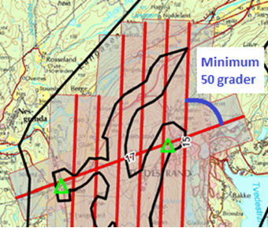

.Enkeltstriper i kjede
[#imgEnkeltstripe]
//[caption="Figure 5:"]
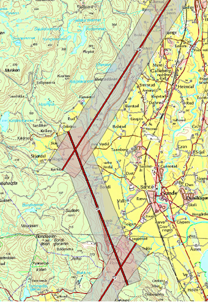

[[kapittel-kontrollflater]]
===== Kontrollflater
Absolutt nøyaktighet på punktsky i vertikaldomene etterprøves ved hjelp av landmålte kontrollflater innenfor kartleggingsområdet. Antall og plassering av kontrollflater bestemmes ved flyplanlegging og kontrollflater må plasseres på en egnet hard og plan flate. Kontrollflater kan legges til områder med grusdekke hvor harde flater ikke er tilgjengelig. 

====
[#krav-laser-kontrollflater-form-og-storrelse,reftext="Krav laser kontrollflater - form og størrelse"]
*KRAV LASER KONTROLLFLATER - FORM OG STØRRELSE*

:xrefstyle: short

* Størrelsen på kontrollflaten er avhengig av den planlagte punkttettheten. Ved punkttetthet fra 0,5 punkt/m^2^ til 3 punkt/m^2^ skal størrelse på kontrollflaten være minimum 16 m^2^. Ved planlagt punkttettheten på 20 punkt/m^2^ er minimumstørrelsen 4 m^2^, se <<tab-kontrollflate>>.

* I tilfeller hvor man ikke finner egnet lokasjon for en kvaderatisk utformet kontrollflate kan det velges en regtagulær form hvor høyden halveres og størrelsen i m^2^ blir ivaretatt. Et eksempel vil være å endre formen på kontrolflaten fra 4x4 meter til 2x8 meter.

* Rundt en kontrollflate skal det være 0,5 m buffersone fri for obstruksjoner.

[[tab-kontrollflate]]
.Minimumskrav til kontrollflatens form og størrelse
[cols="7*",options="header"]
[cols="1,1,1,1,1,1,1,1", options="header"]
|===
| Form Kontrollflate (m)
| Størrelse (m^2^)
| Antall landmålte punkt
5+|Antall lasermålinger innenfor kontrollflaten ved ulik punkttettheter
|||| 0,5 pkt/m^2^
| 2 pkt/m^2^
| 3 pkt/m^2^
| 5 pkt/m^2^
| 70 pkt/m^2^
|4x4|16|25|8|32|||   
|2x8|16|27|8|32|||    

|2x2|4|13|||12|20| 
|0,5x0,5|0,25|5|||||17
|===

====

:xrefstyle: full

.Kontrollflate - punkttetthet < 3 pkt/m^2^
[#imgKontrollflateUnder]
//[caption="Figure 6:"]
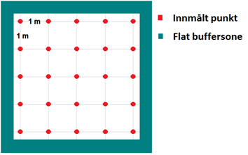

.Kontrollflate - punkttetthet > 3 pkt/m^2^
[#imgKontrollflateOver]
//[caption="Figure 7:"]
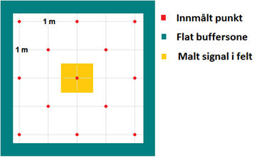

.Kontrollflate - punkttetthet > 70 pkt/m^2^
[#imgKontrollflateOver]
//[caption="Figure 7:"]
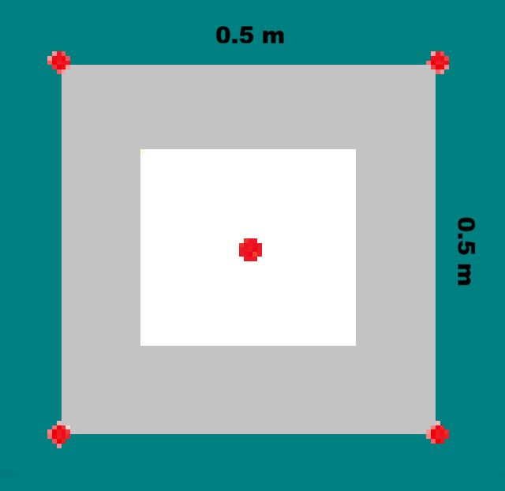

I kartleggingsprosjekt med både Laser og Foto kan senter av kontrollflate signaleres. Signalet skal i så fall inngå i signaleringsplan for foto.

====
[#krav-laser-kontrollflater-Tidsgyldighet="krav-laser-kontrollflater-Tidsgyldighet"]
*KRAV LASER KONTROLFLATER  TIDSGYLDIGHET*

* Kontrolflater og hjulspor skal Måles inn samme år som datafangsten gjennomføres.
Unntak kan avtales der prosjekter går over flere år.

====

====
[#krav-laser-kontrollflater-antall-og-plassering,reftext="Krav laser kontrollflater - antall og plassering"]
*KRAV LASER KONTROLLFLATER - ANTALL OG PLASSERING*

:xrefstyle: short

* En kontrollflates gyldighetsområde defineres med en buffer på 6 km radius fra kontrollflatens senter.
* Kontrollflater skal planlegges slik at hele prosjektområdet er dekket av kontrollflatenes gyldighetsområder. Se <<#imgKontrollflateGyldighet>>.
* Antall kontrollflater skal ikke være under et minimum på 3 flater per sammenhengende skanneblokk. Oppdragstaker kan slå sammen mindre områder til sammenhengende skanneblokk for å redusere behov for flater. Se <<#imgSammenslåingBlokk>>. 
* Avvik fra antall og plassering av kontrollflater (for eksempel ved laserskanning av store områder uten infrastruktur eller mange spredte øyer) kan tillates dersom oppdragsgiver har åpnet for dette i teknisk spesifikasjon for oppdraget. I slike tilfeller skal det sørges for at korrekte GNSS-skift blir påført alle striper.
* Kontrollflatene skal plasseres på en hard flat flate (asfalt, betong, plan og hard grusveg). Som hovedregel skal kontrollflatene plasseres innenfor prosjektavgrensingen. Dersom dette ikke er praktisk mulig, plasseres kontrollflatene i umiddelbar nærhet. Uansett skal laserdata over kontrollflatene inngå i leveransen.  
* Maksimum helning internt i flaten skal ikke overstiger 5 %. Dersom helningen overstiger dette kan en grunnrissfeil påvirke resultatet av høydeanalyse.
* Rundt kontrollflatene skal det være en buffersone på minimum 0,5 m. Helningen på buffersonen skal ikke overskride 5 %. Dersom det ikke benyttes en buffersone rundt målt kontrollflate kan grunnrissfeil påvirke resultatet av høydeanalysen.
* Når kontrollflater måles inn i terrenget er det ikke krav om oppmerking av
målepunktene. I praksis så vil oppmerking være gunstig for å sikre at samme målepunkt blir benyttet. Dersom målepunktene merkes i felt skal det benyttes en krittspray eller kritt som forsvinner etter kort tid.
====

:xrefstyle: full

Som et alternativ til innmåling av tradisjonelle kontrollflater, kan hjulsportmetoden benyttes. Ved hjulspormetoden måler man inn posisjonen til målebilens bakhjul vha. GNSS og treghetsnavigasjonsutstyr (INS). De målte punktene brukes til kontroll og støtte for stripejusteringen. Det benyttes robust statistikk i analysen av høydedifferanser mellom hjulspor og laserdata for å filtrere bort grove feil. Det store antallet målepunkt gir et bra datagrunnlag slik at evt. støy vil bli utlignet av antall målinger. Målinger utført med hjulspormetoden har et gyldighetsområdet tilsvarende en sirkel med radius 6 km. Dette gjelder for samtlige innmålte punkt med hjulspormetoden med tilstrekkelig nøyaktighet.

====
[#krav-Kontrollflater-Hjulspor metoden="krav-Kontrollflater-Hjulspor metoden"]
*KRAV KONTROLLFLATER - HJULSPORMETODEN*

* Svake posisjonsløsninger skal utelates. Nøyaktighet til målingene skal følge <<krav-laser-kontrollflater-noyaktighet>> 
*  Måleutstyret skal kalibreres for hver installasjon. Dokumentasjon for kalibrering skal leveres sammen med kontrollflaten.
* Krav til målingenes utstrekning/spredning er likt for kontrollflatemetoden og hjulspormetoden.
* Ved datainnsamling med hjulspormetoden skal målingene utføres kontinuerlig gjennom prosjektområdet. Dette på en slik måte at hele området er dekket av kontrollmålingenes gyldighetsområder.
* Nøyaktigheten på hjulspormetoden skal tilsvare nøyaktigheten til kontrollflate metoden.
* Alle prosjekt skal ha minst en kontrollflate målt med kontrollflatemetoden. Dette for å kontrollere innmålingssystem for hjulspormetoden der denne metodikken er benyttet. Lokasjonen til denne kontrollflaten skal da være i umiddelbar nærhet til hjulspordataene.
* Helningskravet på maks 5% i <<krav-laser-kontrollflater-antall-og-plassering>> gjelder ikke for hjulspormetoden.
* Det er krav til leveranse av gyldighetsplott for både hjulspormetoden og kontrollflatemetoden.

====

====
[#krav-laser-kontrollflater-noyaktighet,reftext="Krav laser kontrollflater - nøyaktighet"]
*KRAV LASER KONTROLLFLATER - NØYAKTIGHET*

* Punktene i kontrollflaten skal måles inn med standardavvik maksimalt lik 1/3 av kravet til høydenøyaktighet i den ferdige punktskyen. 
* Samme høydereferansemodell skal benyttes for innmåling av kontrollflate som for laser punktskyen.
* Landmålingsarbeidene inkl. rapportering skal utføres i henhold til standarden «Satellittbasert Posisjonsbestemmelse»
====

.Kontrollflaters gyldighetsområde
[#imgKontrollflateGyldighet]
//[caption="Figure 8:"]
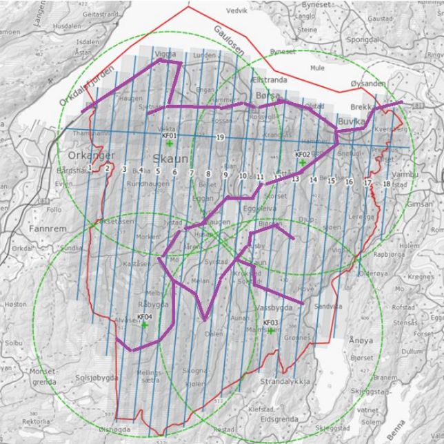

.Sammenslåing av polygoner til en skanneblokk
[#imgSammenslåingBlokk]
//[caption="Figure 9:"]
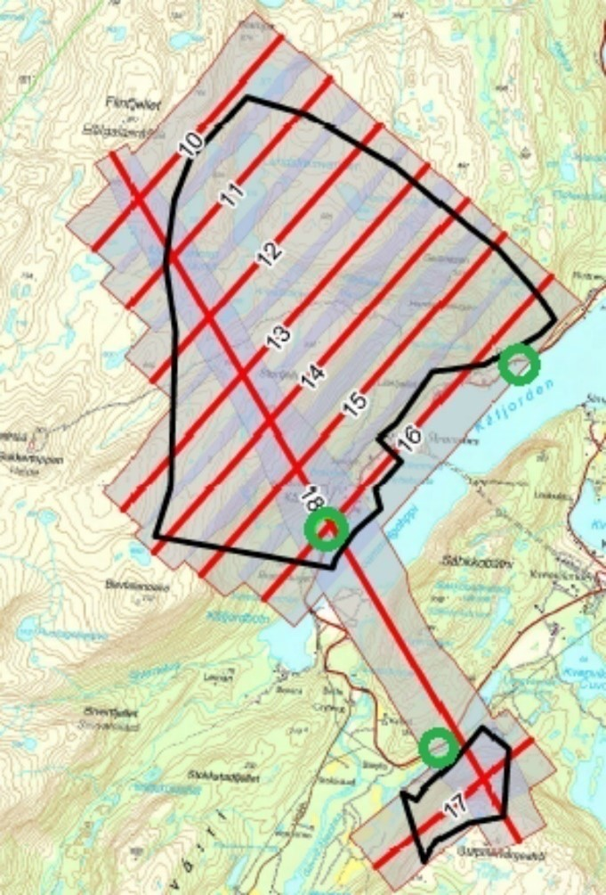

[[kapittel-kontrollprofiler]]
===== Kontrollprofiler
Kontrollprofiler skal benyttes for å kontrollere og eventuelt justere for systematisk avvik i grunnriss. Dersom mønelinjen i eksisterende FKB data oppfyller nøyaktighetskravet kan denne benyttes i grunnrissanalysen. I prosjekt utenfor bebyggelse må terrenglinjer benyttes.

====
[#krav-laser-kontrollprofiler-antall-og-plassering,reftext="Krav laser kontrollprofiler - antall og plassering"]
*KRAV LASER KONTROLLPROFILER - ANTALL OG PLASSERING*

* Et profilpar består av en profil i N-S-retning og en profil i Ø-V-retning.
* Minimum antall profilpar i et laserprosjekt skal være 3.
* Minimum antall profilpar i hver laserblokk skal være 1.
* Profilene kan ha en annen orientering enn N-S/Ø-V, men det skal etterstrebes at profilene i ulik retning er orientert vinkelrett på hverandre.
====

====
[#krav-laser-kontrollprofiler-form-og-storrelse,reftext="Krav laser kontrollprofiler - form og strørrelse"]
*KRAV LASER KONTROLLPROFILER - FORM OG STØRRELSE*

* Ved mønelinjer skal det måles minimum 4 punkt på hver takflate slik at mønelinjen kan beregnes fra skjæringspunktet mellom flatene. 
* Ved terrenglinjer skal det utføres minimum en måling per meter, total lengde bør være minimum 10m. Knekkpunkter i terrenget skal måles.
* Maksimal terrenghelning skal være 60 grader, og minimum terrengvariasjon i høyde på terrengprofilen skal være 2 m.
====

====
[#krav-laser-kontrollprofiler-noyaktighet,reftext="Krav laser kontrollprofiler - nøyaktighet"]
*KRAV LASER KONTROLLPROFILER - NØYAKTIGHET*

* De enkelte punktene i kontrollprofilen skal måles inn med standardavvik maksimalt lik 1/3 av kravet til grunnrissnøyaktigheten i den ferdige punktskyen. 
* Samme høydereferansemodell skal benyttes for innmåling av kontrollprofil som for laser punktskyen. 
* Landmålingsrapport, der hvor GNSS er benyttet, skal utføres i henhold til standarden «Satellittbasert Posisjonsbestemmelse».
====

==== Utføring av datainnsamling
Til forskjell fra flyfotografering, kan laserskanning utføres uavhengig av solvinkel og sollys. Laserskanneren er en aktiv sensor som skaper sin egen belysning av overflaten. Dette medfører at laserskanning i utgangspunktet kan utføres hele året og når som helst på døgnet. Det er likevel viktig å vurdere når på året det er ønskelig å fly med hensyn til vegetasjon og snø. Best gjennomtrengning til bakken vil oppnås før løvsprett eller etter løvfall. Dersom man ønsker å ha en god terrengmodell bør laserskanningen gjennomføres før åkrene og bunnvegetasjon i skog har kommet for langt i vekst.

Laserskanning kan gjerne gjennomføres dersom det er skyer over flyet. Ved fuktighet mellom fly og bakke (snø, regn, tåke eller lavt skydekke) vil imidlertid lyset reflekteres og medføre svært få eller ingen retursignaler fra bakken. FLS bør derfor ikke gjennomføres ved slike forhold. For å unngå skjev punktfordeling og redusert nøyaktighet bør FLS heller ikke gjennomføres ved sterk vind (i flyhøyden) eller ved mye turbulens.

====
[#krav-laser-utforing-av-laserskanning,reftext="Krav laser utføring av laserskanning"]
*KRAV LASER UTFØRING AV LASERSKANNING*

* Krav til GNSS/INS sensor se <<kapittel-krav-til-gnssins>>.
* Krav til GNSS/INS datafangst se <<kapittel-krav-til-innsamling-av-gnssimu-data>>.
* Parallelle nabostriper skal som hovedregel flys i motsatt retning for å bestemme eventuelle systematiske avvik mellom stripene.
====

=== Prosessering av georeferert punktsky

==== Prosessering av GNSS/INS data
Krav til GNSS/INS prosessering for laserskanning baserer seg på krav til GNSS/INS prosessering for Fotogrammetri og det vises til relevante paragrafer i <<kapittel-beregning-av-GNSSINS-data>>. 

Krav til rapportering er detaljert i <<kapittel-egenkontroll-og-rapportering-fotorapport>>, kategori «GNSS/INS».

[[kapittel-matching-av-punktsky]]
==== Matching av punktsky
For å oppnå god nøyaktighet på punktskyen er det nødvendig å utføre matching av laserdataene. Denne prosessen innebærer å beregne og korrigere for systematiske og tilfeldige avvik i punktskyen. Ved matching av laserdata skilles det på daglig kalibrering og stripejustering.

===== Dokumentasjon av daglig kalibrering
Daglig kalibrering er en utvidelse av kalibrering av laserskanneren som er relatert til den enkelte flygning. De innsamlede data i tverrstripeområdene brukes for å beregne gjenværende vinkelavstander mellom de ulike koordinatsystemene og korreksjonsfaktorer for skannermekanismens retningsmåling. 

.Eksempel på dokumentasjon av utført daglig kalibrering
[#imgDokDagligKalib]
//[caption="Figure 10:"]
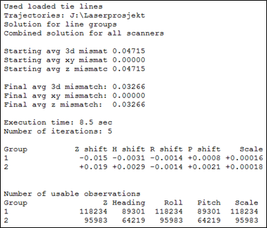

====
[#krav-laser-dokumentasjon-pa-daglig-kalibrering,reftext="Krav laser dokumentasjon på daglig kalibrering"]
*KRAV LASER DOKUMENTASJON PÅ DAGLIG KALIBRERING*

* Beskrivelse av benyttet metode for daglig kalibrering.
* Oppdragstaker skal gi sin vurdering av resultatet.
* Dersom daglig kalibrering ikke påføres skal dette begrunnes.
====

===== Stripejustering

Etter utført daglig kalibrering kan det være gjenværende tilfeldige avvik mellom flystripene i prosjektet. De innsamlede dataene i tverrstripeområder og overlappsområder mellom flystripene benyttes til å beregne stripevise korreksjoner.

.Eksempel på dokumentasjon av utført stripejustering
[#imgStripejust]
//[caption="Figure 11:"]
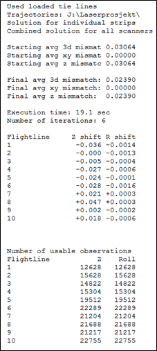

====
[#krav-laser-dokumentasjon-pa-stripejustering,reftext="Krav laser dokumentasjon på stripejustering"]
*KRAV LASER DOKUMENTASJON PÅ STRIPEJUSTERING*

* Beskrivelse av benyttet metode for stripejustering.
* Oppdragstaker skal gi sin vurdering av resultatet.
* Dersom stripejustering ikke påføres skal dette begrunnes.
* Stripejustering og datasettets homogenitet dokumenteres med
homogenitetsplott, se <<krav-laser-dokumentasjon-pa-kontroll-av-punktsky>>.

====

[[kapittel-kontroll-av-punktsky-systematiske-avvik]]
==== Kontroll av punktsky, systematiske avvik
Erfaring viser at det ofte er behov for korreksjon for systematiske avvik i de enkelte prosjekter. 

Ulike Feilkilder som kan gi systematiske avvik er:

* GNSS/INS løsningen
* Systematisk avvik fra stripejustering
* Ytre væravhengige faktorer som trykk og temperatur
* Kalibrering av instrumentet

Med bakgrunn i dette stilles det i det følgende krav om bruk av kontrolldata. For å kontrollere høydenøyaktighet benyttes kontrollflater og for å kontrollere grunnriss benyttes kontrollprofiler.  

===== Kontroll av høydenøyaktighet

Kontrollflater skal benyttes for å kontrollere og eventuelt justere for systematisk avvik i høyde på punktskyen. Analysen mot kontrollflaten skal utføres mot alle klasser med unntak av klasse 7 «støy-punkter». 

Oppdragstaker skal begrunne årsak til at en kontrollflater som skiller seg fra resterende flater forkastes. Benyttede kontrollflater i justering og statistikk skal være i henhold til antall spesifisert i godkjent flyplan. Ved avvik uten åpenbare forklaringer (terrengendringer) skal det utføres kontrollmåling. 

====
[#krav-laser-dokumentasjon-pa-hoydekontroll,reftext="Krav laser dokumentasjon på høydekontroll"]
*KRAV LASER DOKUMENTASJON PÅ HØYDEKONTROLL*

:xrefstyle: short

* Beskrivelse av benyttet metode for høydekontroll. 
* Dokumentasjon av beregnet og påført høydejustering på laserdataene.
* Det kan maksimalt justeres for ett systematisk avvik i øst, nord og høyde per prosjektområde.
* Endelig resultat etter eventuell høydejustering skal dokumenteres med høyderapport per kontrollflate, samt en sammenfattet oversikt med statistisk informasjon for alle flater. Se <<#imgDokKontrollFL>> og <<tab-statistikk-kontrollFL>>.
* Oppdragstaker skal gi sin vurdering av resultatet.
* Kontrollflatenes navngiving skal følge navngiving i landmålingsrapporten.
====

:xrefstyle: full

.Eksempel på dokumentasjon per kontrollflate
[#imgDokKontrollFL]
//[caption="Figure 11:"]
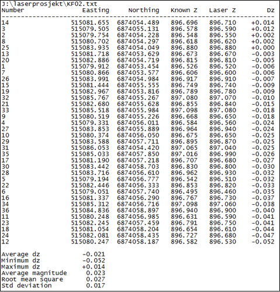

[[tab-statistikk-kontrollFL]]
.Eksempel på samlet oversikt over statistikk fra kontrollflatene
[width="100%",options="header"]
|===
|Kontrollflate|Gjennomsnitt dZ (m)|Maksimum dZ (m)|Minimum dZ (m)|RMS (m)|Standardavvik (m)
|KF01|0,026|0,039|0,013|0,027|0,006
|KF02|-0,021|0,014|-0,052|0,027|0,017
|KF03|0,014|0,029|-0,003|0,016|0,008
|KF04|-0,009|0,001|-0,029|0,012|0,007
|===
===== Kontroll av grunnrissnøyaktighet

For å dokumentere de aktuelle prosjektenes kvalitet i grunnriss skal målte kontrollprofiler benyttes for grunnrisskontroll.

Oppdragstaker skal undersøke og kommentere eventuelle avvik i grunnrisskontrollen som overstiger kravet til grunnrissnøyaktighet for det aktuelle prosjekt.  

====
[#krav-laser-dokumentasjon-pa-grunnrisskontroll,reftext="Krav laser dokumentasjon på grunnrisskontroll"]
*KRAV LASER DOKUMENTASJON PÅ GRUNNRISSKONTROLL*

:xrefstyle: short

* Beskrivelse av benyttet metode for grunnrisskontroll.
* Dokumentasjon på beregnede avvik i grunnriss i sammenfattet oversikt. Se <<tab-statistikk-kontrollprofil>>.
* Oppdragstaker skal gi sin vurdering av resultatet.
* Kontrollprofilenes navngivning skal følge navngivning i landmålingsrapport.
====

:xrefstyle: full

[[tab-statistikk-kontrollprofil]]
.Eksempel på samlet oversikt over målte avvik i grunnriss
[width="100%",options="header"]
|===
|Kontrollprofil|Type profil|Retning (grader)|Målt avvik (m)|Avvik dN (m)|Avvik dE (m)
|KP01|Mønelinje|6|0,08|0,01|0,08
|KP02|Mønelinje|97|0,10|0,10|-0,01
|KP03|Terrenglinje|13|0,09|0,02|0,09
|KP04|Mønelinje|290|0,09|-0,08|0,03
|KP05|Terrenglinje|9|0,11|0,02|0,11
|KP06|Mønelinje|95|0,17|0,17|-0,01
|===

[[kapittel-dokumentasjon-av-homogenitet]]
==== Dokumentasjon av homogenitet

Punktskyen må kontrolleres for tilfeldige feil. Dette er viktig for å avdekke mulige grove feil og manglende homogenitet i punktskyen. 

Typiske feilkilder er:

* Drift i GNSS/INS-løsningen.
* Stripejustering.
* Kalibrering av instrumentet.

Oppdragstaker skal gi sin vurdering av resultatet. Resultatet skal være homogent, eventuelle mønster skal ikke forekomme.

.Eksempel på plott over beregnede høydeavvik mellom flystriper
[#imgHomogenitet]
//[caption="Figure 15:"]
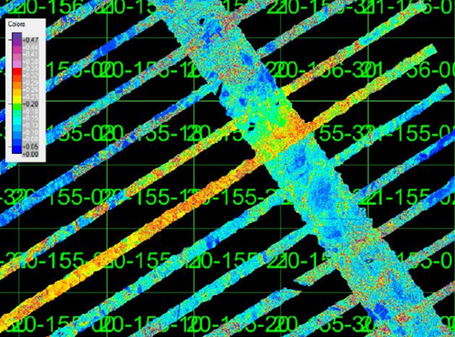

====
[#krav-laser-dokumentasjon-pa-kontroll-av-punktsky,reftext="Krav laser dokumentasjon på kontroll av punktsky"]
*KRAV LASER DOKUMENTASJON PÅ KONTROLL AV PUNKTSKY*

* I overlappsområder skal det beregnes høydeavvik mellom stripene ved sammenligning av automatisk klassifisert terrengmodell for hver flystripe.
* Resultatet skal dokumenteres numerisk i tabell
* Oppdragstaker skal gi sin vurdering av resultatet.
* Stripejustering samt systemets kalibrering kan dokumenters med en av følgende fremgangsmåter:
* Homogenitetsplott før og etter matching/stripejustering.
* Resultat fra daglig kalibrering, stripejustering og homogenitetsplott etter matching/stripejustering.
* Homogenitetsplottet skal dokumenteres med kartbladvise georefererte TIF-filer med oppløsning 1m, med tilhørende dZ-verdi per piksel i meter med 2 desimaler.
====

[[kapittel-bearbeiding-av-laserdata-klassifisering]]
=== Bearbeiding av laserdata (klassifisering)

Hvert punkt i punktskyen kan klassifiseres i separate klasser. Vanligste form for klassifisering er å klassifisere en terrengmodell ved å skille punkter som er treff på bakken fra de øvrige punktene i punktskyen. Avhengig av formålet med laserskanningen vil oppdragstakeren kunne klassifisere punktene i ulike lag, for eksempel bygninger, broer, vann, objekter 0–2 m over bakken. 

Gjeldende versjon av dokumentet Produktspesifikasjon Nasjonal modell for høydedata fra laserskanning (FKB-Laser) detaljerer hvilke klasser som tillates. 

For å sikre et godt sluttresultat må datasettet gjennomgå en manuell etterkontroll for å fange eventuelle feil introdusert ved kjøring av automatiske klassifiseringsrutiner.

==== Grovfeilsøk
I laserdata vil det forekomme feil av type atmosfæriske treff og lave punkter som skyldes "multipath" eller gal bestemmelse av siste puls. Punkter av den siste feiltypen vil ofte bli inkludert i terrengmodellen siden mange klassifiseringsrutiner bygger på det prinsippet at det laveste punktet innen et gitt areal antas å tilhøre terrengmodellen. Prosessen med å oppdage lave punkter omfatter både automatiske rutiner og visuell betraktning av for eksempel skyggelagte relieffbilder. 

==== Klassifisering av terrengmodell
Klassifisering av terrengmodell innebærer å skille punkter som er treff på bakken fra de øvrige punktene i punktskyen. Oppdragstaker optimaliserer parametersettingen på automatiske klassifiseringsrutiner for å redusere behovet for manuelt etterarbeid.

==== Klassifisering av andre objekter

Ved behov kan oppdragsgiver etterspørre klassifisering av objekter utover terrengmodell. Mulig klassifisering kan være bruer, store steiner, bygninger og kraftledninger. Supplerende vektordata kan være til støtte ved klassifisering av objekter. 

====
[#krav-laser-klassifisering,reftext="Krav laser klassifisering"]
*KRAV LASER KLASSIFISERING*

* Oppdragstaker skal dokumentere benyttet programvare for feilsøking. 
* Oppdragstaker skal dokumentere benyttet programvare for automatisk klassifisering av terrengmodell.
* Ved klassifisering av andre objekter kan det benyttes FKB-data og andre vektordata for å sikre samsvar mellom konstruksjon og klassifisert punktsky. 
* Manuell inspeksjon av laserdataene skal utføres for å sikre at feilklassifiseringer og mangelfull klassifisering fra de automatiske klassifiseringsrutinene korrigeres. 
====

=== Egenkontroll og rapportering (laserskanning)

====
[#krav-laser-rapportering-laserskanning,reftext="Krav laser rapportering laserskanning"]
*KRAV LASER RAPPORTERING LASERSKANNING*

:xrefstyle: short

* Rapport for laserskanning skal som minimum inneholde informasjonen spesifisert i <<tab-rapport-laserskanning>>.

:xrefstyle: full

[[tab-rapport-laserskanning]]
.Krav til rapportering av laserskanning
[cols="3*",options="header"]
|===
|Kategori|Element|Innhold
.10+|Generell informasjon|Oppdragsgiver|(adresse og prosjektleder)
|Oppdragets navn og nummer|(LACHFFXX)
|Dekningsnummer|(XX-12345)
|Punkttetthet|(X pr m^2^)
|Datum|(horisontalt datum, vertikalt datum, projeksjon og benyttet HREF modell)
|Oppdragstaker|(adresse, prosjektleder, fagansvarlig og underleverandører)
|Beskrivelse av oppdraget|(produkt, areal, referanse til standarddokumenter)(eventuelle endringer/ utvidelser til opprinnelig teknisk spesifikasjon)
|Antall eksemplar av rapport|(antall og oppbevaringssted)
|Versjon|(rapportversjonsnummer)
|Datering og signatur|(dd.mm.åååå, signatur)
.2+|Landmålingsrapporter|Rapport innmåling Kontrollflater/Hjulspormetoden|Dokumentasjon i henhold til krav stilt i <<kapittel-kontrollflater>>.
Rapport fra innmåling av kontrollflater skal legges ved som vedlegg til
prosjektrapporten. Rapporten fra innmålingen skal inneholde bilder av
innmålte flater, gjelder ikke for hjulspormetoden.
|Rapport innmåling Kontrollprofiler|Dokumentasjon i henhold til krav stilt i <<kapittel-kontrollprofiler>>
.7+|Gjennomføring av Laserskanning|Fly|(fabrikat, type, kallesignal og trykkabin ja/nei)
|Skannersystem a|* Skanner: +
** Fabrikat, type, serienummer og eventuelt revisjonsnummer. +
** Leverandørkalibreringer: +
Dokumentasjon i henhold til krav stilt i <<kapittel-kalibrering-av-laserskanneren>> +
* Gyromount:	+
** Fabrikat og type. +
* GNSS-mottaker og antenne: +
** Fabrikat, type, serienummer og benyttet loggerate. +
* IMU: +
** Fabrikat, type, serienummer og benyttet loggerate. +
* Beskrivelse av hvordan antenneeksentrisitet er bestemt, dokumentasjon av andre eksentrisiteter (for eksempel IMU montering) +
* Installasjonskalibreringer: +
Dokumentasjon i henhold til krav stilt i <<kapittel-kalibrering-av-laserskanneren>>. +
* Beskrivelse av utført initialisering av GNSS/INS-utstyr +
|Klarmelding a|* Tidspunkt for avgitt klarmelding(er) for laserskanning +
* Kopi av klarmelding(er) og flyfirmaets bekreftelse på denne/disse
|Progresjon|Oversikt over flydager med skannede flystriper per flydag.
|Værforhold|Beskrivelse av generelle forhold, inkludert skyforhold, sikt, vind og turbulens. +
Ved vanskelige forhold skal det rapporteres hvilke striper dette kan angå.
|Problem, utfordringer og kommentarer til arbeidet a|Eventuelle problemer i forbindelse med gjennomføringen: +

* Beskrivelse av problemer, inkludert årsaker til disse, som vil eller kan resultere i negative konsekvenser for mellom- og/eller sluttprodukter. +
* Beskrivelse av tilhørende utførte tiltak. +
* Beskrivelse av mulige konsekvenser av problemene.
|Vurdering av resultat|En samlet vurdering av utføringen av laserskanningen og kvaliteten på arbeidene med hensyn til bestilling og øvrige krav.
.5+|Bearbeiding av Laserdata|GNSS/INS Beregning a|* Beregningsdato (dato for ferdigstilling av beregning). +
* Programvare (fabrikat og versjonsnummer). +
* Prinsipp/metode for beregning av GNSS/INS-løsning. +
* Eventuelle geodetiske transformasjoner. +
* Eventuelle høydetransformasjoner/høydeskaleringer. +
* Eventuelle andre transformasjoner eller korreksjoner. +
* Vurdering av resultatet.
|Matching av punktsky|Dokumentasjon i henhold til krav stilt i <<kapittel-matching-av-punktsky>>
|Kontroll av Punktsky +
Systematiske Avvik|Dokumentasjon i henhold til krav stilt i <<kapittel-kontroll-av-punktsky-systematiske-avvik>>
|Kontroll av Punktsky +
Homogenitet|Dokumentasjon i henhold til krav stilt i <<kapittel-dokumentasjon-av-homogenitet>>
|Bearbeiding av Laserdata +
Klassifisering|Dokumentasjon i henhold til krav stilt i <<kapittel-bearbeiding-av-laserdata-klassifisering>> 
.2+|Leveranser|Produktspesifikasjon|Versjon av produktspesifikasjon og objektkatalog
|Leveranser a|En fullstendig oversikt over alle leverte data, metadata og eventuelt medfølgende dokumentasjon skal listes opp. Oversikten skal minimum inneholde: +

* Spesifikasjon av leveranseformat, medium og eventuell inndeling i kataloger og filer. +
* Spesifikasjon av enheter (koordinater, rotasjoner, avstander og så videre).
|===
====

