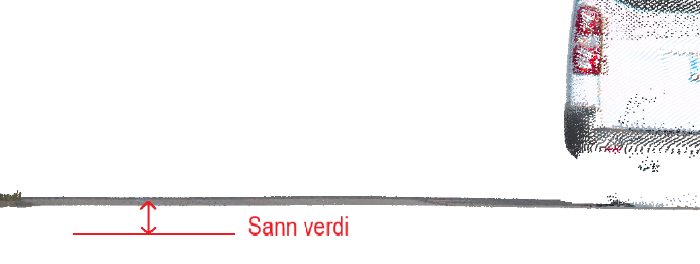
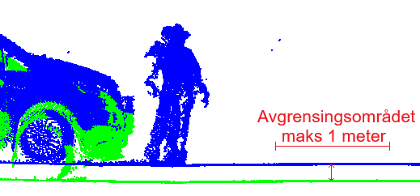
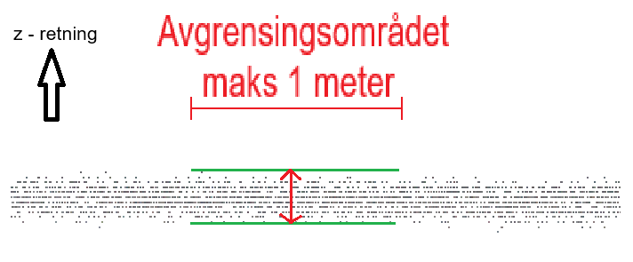

:xrefstyle: short
[[kapittel-kartlegging-med-mobil-datafangst]]
== Kartlegging med mobil datafangst

=== Innledning
Datainnsamling med mobile lasersystemer (MLS), brukes ofte i kombinasjon av andre innsamlingsmetoder. I tillegg til laserskanner, kan datainnsamlingen utføres med opptak fra ulike sensorer som optiske kamera og georadar.

Standarden beskriver krav og anbefalinger for å sikre kvaliteten til sluttproduktet. Selve definisjonen av og kravet til sluttproduktene, vil ligge i registreringsinstrukser og produktspesifikasjoner. En viktig målsetting med standarden, er å legge til rette for økt bruk og gjenbruk av data fra MLS datafangst.

=== Omfang
Standarden omfatter mobil datafangst med laser med opsjonelt kamera.

=== Posisjonering av mobil datafangst
MLS benytter seg av posisjons- og orienteringssystemer bygd opp rundt et treghetsnavigasjonssystem, også kalt "Inertial Navigation System" (INS). Et INS består av en "Inertial measurement Unit" (IMU) og tilhørende støttesensorer. Den primære støttesensoren er vanligvis en eller flere GNSS-mottakere ("Global Navigation Satellite System"), ofte i kombinasjon med optisk eller mekanisk hastighets-  eller distansemåling (odometer). Det er også mulig å benytte andre former for støtteobservasjoner fra ulike sensorer sammen med et INS. Eksempler på dette har vi fra robotverden og "Simultaneous Localization and Mapping" (SLAM).

=== GDPR
Laser punktsky (også fargelagt punktsky) fra mobil datafangst vil i de fleste tilfellene ikke kunne brukes til å identifisere personer eller bilskilt.  Produktet vil da ikke omfattes av https://lovdata.no/dokument/NL/lov/2018-06-15-38[GDPR-forordningen]. Det vil være oppdragsgivers ansvar å påse at dette gjelder for sitt prosjekt. Bildematerialet for en mobil datafangst, vil som hovedregel være omfattet av GDPR forordningen og nødvendige tiltak må utføres.

=== Fargelegging av punktsky
Påføring av fargeverdier på punktskyen, er opsjonelt. Dersom opsjon utløses bør følgende kvalitetselementer hensyntas:

====

[#anbefaling-fargelegging-av-punktsky, reftext="Anbefaling ved fargelegging av punktsky"]
*ANBEFALING VED FARGELEGGING AV PUNKTSKY*

[[tab-fargelegging-av-punktsky]]
.Fargelegging av punktsky
[width="100%",options="header"]
|====================
| Kvalitetselement  | Beskrivelse | Kvalitetsmål
| Tidsriktighet |Tiden mellom bilder og lasermålinger  | Bør være tatt samme dag.
| Fargekvalitet | Naturtro farger  |  Subjektiv vurdering  
| Lysforhold | Tilstrekkelig lysmengde til at lukkertid/bilens hastighet kan settes slik at bildene forbli skarpe.   |  Lysforholdene bør være tilstrekkelige for å få fram informasjonen ønsket i hovedmålsettingen.
| Oppløsning | Bildepikslenes faktiske størrelse i terrenget | Bør sammenfalle med produktets krav til detaljrikdom.
| Posisjon og orientering | Geometrisk nøyaktighet til kameraet |Bør ha samme kvalitet som laserdataene.
|GDPR  | Informasjon som faller inn under GDPR-forordningen  |  Skal redigeres.
|==================== 

====
=== Klassifisering
Klassifisering av punktsky er opsjonelt. Der produktets målsetting krever klassifisering, følges kravene til klassifisering gitt i <<bearbeiding-av-laserdata-klassifisering>>.

=== Ulike kvalitetsnivåer
Produkter fra mobil datafangst deles inn i ulike kvalitetsnivåer. De ulike nivåene vil påvirke kompleksitet, kostnad og krav til stedfestingsnøyaktighet. Det laveste nivået innebærer lav absoluttnøyaktighet. Mulige bruksområder kan være analyser knyttet til kollisjon, kjøreboks og vegetasjon, der relative målinger er viktigst. Nivåene «middels» og «god» kan brukes til generell prosjektering, tunnelinnmåling, NVDB/FKB-kartlegging og overvannsanalyser. Punktskyen er her en større del av sluttproduktet og ofte supplert med ekstra målemetoder som landmåling, terrestrisk skanning eller flybåren laserskanning. Det høyeste nivået brukes der høy absolutt stedfestingsnøyaktighet er nødvendig, for eksempel i jernbaneprosjektering, kontroll og vedlikehold av spor og tunneler, samt endringsanalyser som krever svært presise punktskydata.

=== Kvalitetselement og kvalitetsmål
For mobil datafangst, deles kvalitetselementene i tre kategorier: Stedfestingsnøyaktighet, Fullstendighet, Egenskapskvalitet. Innenfor hver kategori defineres et sett med ulike kvalitetselementer med videre definerte kvalitetsmål. Ved bestilling må alle kvalitetselementene tas stilling til.

==== Stedfestingsnøyaktighet
Med stedfestingsnøyaktighet menes hvor godt stedfestingen til et objekt samsvarer med virkeligheten, realisert i angitt referanseramme. Metoden som brukes til å evaluere absolutt stedfestningsnøyaktighet følger standarden https://register.geonorge.no/standarder/sosi/standarder-geografisk-informasjon/geodatakvalitet[Geodatakvalitet]. Kravene gjelder for tydelige, veldefinerte objekter innenfor prosjektområdet. Kvalitetselement knyttet til kriteriet om stedfestingsnøyaktighet er angitt i    <<tab-kvalitetselementer-knyttet-til-kategorien-stedfestingsnøyaktighet>> med beskrivelse.

[[tab-kvalitetselementer-knyttet-til-kategorien-stedfestingsnøyaktighet]]
.Kvalitetselementer knyttet til kategorien stedfestingsnøyaktighet
[cols="1,1a"]
[width="100%",options="header"]
|====================
|Kvalitetselement|Beskrivelse 

|Absolutt stedfestingsnøyaktighet| Absolutt stedfestingsnøyaktighet deles inn i tre kvalitetsmål: Systematisk avvik, tilfeldig variasjon og maks avvik.

*Kvalitetsmålet systematisk avvik* baserer seg på avvik mellom senter punktsky og punktskyens sanne verdi, målt i enten i høyde (Z), grunnriss (XY), eller 3D (XYZ). Dette gitt i prosjektets referanseramme. Den midlere verdien av de målte avvikene gir det systematiske avviket. Kvalittetsmålet følger standarden https://register.geonorge.no/standarder/sosi/standarder-geografisk-informasjon/geodatakvalitet[Geodatakvalitet].

.Rød pil viser en måling som kan inngå i beregningen av absolutt stedfestingsnøyaktighet, systematisk avvik. 

*Kvalitetsmålet tilfeldig variasjon* tar utgangspunkt i målingene utført for å beregne systematisk avvik. Målingene brukes til å beregne standardavvik og følger standarden https://register.geonorge.no/standarder/sosi/standarder-geografisk-informasjon/geodatakvalitet[Geodatakvalitet]. 

*Kvalitetsmålet maks avvik* tar utgangspunkt i målingene utført for å beregne systematisk avvik hvor størst målte avvik angir kvalitetsmålet maks avvik.

|Relative Stedfestningsnøyaktighet| Relative stedfestningsnøyaktighet undersøkes innad i et avgrenset observerbart område på harde veldefinerte flater. 

Avgrensing:

* Avstand fra skanner (maks 10 meter). Der skannerens posisjon ikke er kjent gjelder avstand til senterlinje for kjørebane.
* Fysisk utstrekning (min 20 laserpunkt, maks 1 m2)
* Området må være flatt

Målingene for å beregne relative Stedfestningsnøyaktighet utføres langs loddlinjen til avgrensningens senterpunkt. Relative stedfestningsnøyaktighet deles inn i de to kvalitetsmålene systematisk avvik og tilfeldig variasjon:

*Systematisk avvik* beregnes ut fra flere utvalgte avgrensningsområder. For hvert området måles avstanden mellom senter punktsky for skanninger utført i forskjellig tidsintervaller. Et tidsintervall vil typisk være kun få sekunder. Middelet av målingene fra alle de utvalget avgrensningsområdene gir det systematiske avviket. 

.Figuren viser to ulike skanninger av det samme avgrensningsområdet. Rød pil viser måling som kan inngå i beregning av relative nøyaktighet, systematisk avvik høyde.

*Tilfeldig variasjon* angir målestøy til sensoren. Den tilfeldige variasjonen måles innenfor godkjente avgrensingsområder hvor lasermålingene er utført innenfor et svært tidsbegrenest intervall (kun få sekunder). Dersom avgrensningsområdet er skannet flere ganger skal skanningene behandlets hver for seg når en beregner tilfeldig variasjon.

.Figuren viser en skannet punktsky sett fra siden, rød pil viser relative nøyaktighet, tilfeldig variasjon

|====================

====
[[Krav-stedfestingsnøyaktighet]]
*KRAV TIL STEDFESTINGSNØYAKTIGHET VED MOBIL DATAFANGST*

[[tab-krav-til-stedfestingsnøyaktighet-ved-mobil-datafangst]]
.Krav knyttet til kriterier om stedfestingsnøyaktighet
[cols="1,1,1,1,1,1]
[width="100%",options="header"]
|====================
|Kvalitetselement|Kvalitetsmål|Lav (cm)|Middels (cm)|God (cm)|Høy (cm)
|Absolutt stedfestingsnøyaktighet |Systematisk avvik ^|0 - 200 ^|0 - 20 ^|0 - 6 ^|0 - 2

| |Standardavvik ^|<50 ^|<5 ^|<2 ^|<1 
| |Maks avvik 4+^|Systematisk avvik + 2 x Standardavvik

|Relativ nøyaktighet |  Systematisk avvik  ^| 0 - 200 ^|0 - 10 ^| 0 - 4 ^|0 - 2
 
| |Tilfeldig varisasjon, Toleranse ^|5 (+0/-5) ^|5 (+0/-5) ^|3 (+0/-3) ^|1 (+0/-1) 

--- 

|====================
====

===== Kjentpunkt
Se definisjon <<termer-kjentpunkt>>.

===== Kontrollpunkt

Se definisjon <<termer-kontrollpunkt>>.

Den absolutte nøyaktighet til kjentpunktet, skal være like eller bedre enn kravet til den absolutte nøyaktigheten til punktskyen. Dersom nøyaktigheten er 1/3 av kravet, kan kontrollpunktene benyttes direkte i statestikkberegningene. Dersom nøyaktighetene til kontrollpunktene er svakere, skal standardavviket til kjentpunktene benyttes i statestikkberegningene. Dette etter krav i standarden  https://register.geonorge.no/standarder/sosi/standarder-geografisk-informasjon/geodatakvalitet[Geodatakvalitet]. Det stilles ikke konkrete krav til omfang av kjent- og kontrollpunkt, ettersom prosjektområde, GNSS tilgjengelighet, målesystem og prosesseringsløyper har stor betydning for kvaliteten som oppnås rett fra INS. Metodikk og omfang skal være behovsstyrt og faglig begrunnet av leverandør i hvert enkelt oppdrag.

===== Kontrollmetode og kontrollplan

Kontroll kan gjennomføres ved å benytte en eller flere metodikker:

* Innmålte kontrollpunkt, 
Tradisjonelt innmålte kontrollpunkt er fysiske objekt som lar seg gjenfinne i punktskyen, for eksempel i form av geometri eller intensitet. Kontrollpunkt kan eksempelvis være signalerte flater, targets eller skarpe detaljer.

* Gjentatte passeringer ved mobil datafangst,
Gjentatte passeringer ved mobil datafangst vil kunne gi observasjoner/ målinger av samme. Metoden kan erstatte innmålte kontrollpunkt dersom:
** Passeringene har tilstrekkelig tidsforskyvning over 15 minutter
** Datasettene skal være fri for systematiske avvik, dokumentert med kalibrering
** Samsvaret mellom passeringene dokumenteres i XY og Z
** Avviket ligger innenfor kravene for valgt nøyaktighetsnivå

* Andre uavhengige datakilder,
Andre uavhengige datakilder kan benyttes dersom deres kvalitet er tilstrekkelig for kontroll av det aktuelle kravet. Eksempler på andre uavhengige kilder er

** Eksisterende høydedata
** FKB / NVDB eller andre kvalitetssikrede vektordatasett
** Andre datasett av kjent kvalitet

Uavhengig av kontrollmetodikk, skal leverandøren utarbeide en kontollplan hvor det beskrives hvor store feil kontrollmetodikken er i stand til å avdekke ved kontrollpunktene. Videre skal det angis hvor store feil som kan oppstå mellom kontrollpunktene.

==== Fullstendighet
I kvalitetskategorien fullstendighet inngår elementene _dekning,_ __punkttetthet__, __detaljeringsgrad__, _punktdistribusjon_ og __overlapp foto__. Disse beskriver hvor komplett datasettet er, hvor tett punktene ligger, hvor detaljert informasjonen er, hvordan punktene fordeler seg i området og hvor mye fotodata overlapper hverandre. Kvalitetselementer knyttet til kriteriet om fullstendighet er angitt i tabell <<tab-kvalitetselementer-knyttet-til-kriteriet-om-fullstendighet>> med beskrivelse.

[[tab-kvalitetselementer-knyttet-til-kriteriet-om-fullstendighet]]
.Kvalitetselementer knyttet til kriterier om fullstendighet
[width="100%",options="header"]
|====================
|Kvalitetselement | Beskrivelse 
|Dekning |Punktsky fra bilbåren laserskanning begrenser seg til å dekke omgivelser der sensoren har innsyn fra de kjørbare, harde flatene i prosjektet. Krav til dekning innenfor prosjektområdet må fremkomme av produktspesifikasjonen i det enkelte prosjektet. Eksempelvis dersom det er krav til full dekning innenfor hele prosjektområdet må dette fremkomme av kravspesifikasjonen, slik at eventuelle skyggepartier fra den bilbårne innsamlingen kan vurderes supplert med andre innsamlingsmetoder.

|Punkttetthet|Punkttettheten må være tilstrekkelig høy til å kunne identifisere og definere objekter i punktskyen relevant for det enkelte prosjekt.
|Detaljeringsgrad | Detaljeringsgraden i prosjektet sier noe om krav til nivå av definerbarhet av relevante objekter i punktskyen. Detaljeringsgraden stiller med det krav til punkttetthet.
|Punktdistribusjon | Hvordan punktene blir fordelt i punktskyen er avhengig av valg av skanner under datainnsamling, samt valg av skanningsparametere og -hastighet. Hva som er optimal punktdistribusjon i det enkelte prosjekt er avhengig av bruksområde og sluttprodukt. 
|====================

==== Egenskapskvalitet
I kategorien egenskapskvalitet inngår elementene __fotavtrykk__, __itensitet__, __farge__, _målemetode (fase/puls)_ og __sensorID__. 
Disse elementene beskriver kvaliteten på ulike egenskaper ved datainnsamlingen, som fotavtrykkets størrelse <<Laserskanner>>, målt intensitet, eventuell fargeinformasjon, hvilken målemetode som er brukt, samt identifikasjonen til sensoren som har samlet inn dataene.
Med egenskapskvalitet i standarden https://register.geonorge.no/standarder/sosi/standarder-geografisk-informasjon/geodatakvalitet[Geodatakvalitet], menes nøyaktighet av kvantitative egenskaper (kan måles på en skala) og riktighet av ikke-kvantitative egenskaper (egenskaper som skiller ut informasjon, men uten å kunne rangeres) og eventuelt objektenes klassifisering og relasjoner. 
Kvalitetselementer knyttet til kriteriet om egenskapskvalitet er angitt i <<tab-kvalitetselementer-knyttet-til-kriterier-om-egenskapskvalitet>> med beskrivelse.

[[tab-kvalitetselementer-knyttet-til-kriterier-om-egenskapskvalitet]]
.Kvalitetselementer knyttet til kriterier om egenskapskvalitet
[width="100%",options="header"]
|====================
|Kvalitetselement |Beskrivelse
|Fotavtrykk|Laserstrålens fotavtrykk er avhengig av sensorens spesifikasjoner, avstanden mellom observert objektet og lasersensoren, samt innfallsvinkelen til objektet som måles. Fotavtrykkets avgrensning defineres ut ifra en prosentvis reduksjon av lysintensitet fra fotavtrykkets senter. Fotavtrykkets yttergrense settes der energien målt fra fotavtrykkets senter er redusert til 1/e2 som utgjør omtrent 13,5 %. Kvalitetsmålet er maksimalt fotavtrykk innenfor dekningsområdet til prosjektet.
|Itensitet|Alle målepunkter i punktskyen skal ha en intensitetsverdi. Ved bruk av flere lasersensorer i innsamlingen må intensitetsverdier tilpasses (strekkes) ved behov for å oppnå en homogen punktsky.
|Farge| Punktene i punktskyen kan gis RGB-farge fra bilder tatt samtidig som laserskanningen, med forutsetning om at datainnsamling kan utføres i tilstrekkelige lysforhold. Farge er valgfritt og opp til det enkelte prosjekt å vurdere om relevant og derfor om det skal stilles krav til dette eller ei. Kvalitetsmålet er å angi med eller uten fargelagt punktsky.
|Målemetode (fase/puls)|Valg av lasersensortype, fase- eller pulsskanner, avhenger av sluttprodukt og bruksområde.  Kvalitetsmålet er å angi skannertype.
|SensorID|Punkter fra ulike skannere skal kunne skilles fra hverandre. Kvalitetsmålet er å angi skanneridentifikasjon på punktnivå.
|Tidsstempling|Dato og tid for målepunkter, hvis tilgjengelig for sensortypen, angitt som GPS standard tid. Dersom systemet ikke angir GPS tid skal siste datafangst dato angis i punktskyfilens hode.
|====================

=== Dokumentasjonskrav

====
[[Krav-dokumentasjon-av-mobil-datafangst]]
*KRAV - DOKUMENTASJON AV MOBIL DATAFANGST*

Leverandøren skal utarbeide en sluttrapport som svarer ut:

* Kravene til rapportering beskrevet i kapittel 7 (det som er aktuelt for mobil datafangst) - Undersøker muligheten for å lage et dokumentasjonskapitel. 
* Kontrollplanen
* Beskrive og dokumentere oppnådd resultat for alle kvalitetskategoriene:
** Stedfestingsnøyaktighet
** Fullstendighet
** Egenskapskvalitet
====

