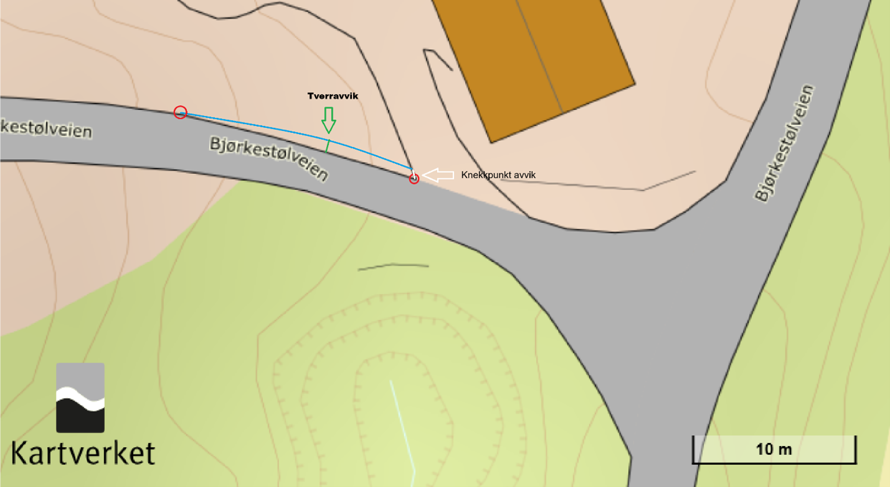

[#vektorisering-fra-punktsky-og-modell, reftext="Vektorisering fra punktsky og modell som metode for etablering av basis geodata"]
== Vektorisering fra punktsky og modell som metode for etablering av basis geodata

=== Innledning
Vektorisering fra punktsky og modell kan være en alternativ metode til fotogrammetrisk kartkonstruksjon for fremstilling av vektordata. Metoden er særlig aktuell for punktskyer fra mobil datafangst og drone, men kan også være aktuell for andre datafangst metoder.

Vektorisering fra punktsky innebærer bruk av automatiserte og manuelle operasjoner som tar utgangspunkt i geometri og intensitetsinformasjon i punktsky for fremstilling av vektordata. Egnethet og kvalitet vil variere for ulike objekttype. Dersom ulike sensortyper benyttes til fremstilling av punktskyen slik som fargelagt punktsky skal bildematerialet og laser punktskyen inneha samme geometriske kvalitet og tidsepoke (innenfor et døgn).

Vektorisering fra modell innebærer bruk av automatiserte og manuelle operasjoner som tar utgangspunkt i geometri og fargeinformasjon fra et 3D ortofoto / 3D Mesh. Egnethet og kvalitet vil variere for ulike objekttype. 

Felles for begge tilnærmingene er at Krav til vektorisering følger kravene i registreringsinstruksen gitt for den objekttypen som skal vektoriseres.

=== Kvalitetsparametere ved vektorisering fra punktsky
Oppnådd kvalitet på vektordata kartlagt fra punktsky/modell vil være påvirket av flere faktorer. Vi kan skille mellom kvalitetselementer knyttet til datagrunnlaget, og kvalitetselementer i selve arbeidet med fremstilling av vektordata fra datagrunnlaget.  Kvalitetselementene til datagrunnlagt følger angitte elementer gitt av datafangstmetode. Kartlegging fra bildedata følger <<Kartlegging med fotogrammetri>>, punktsky fra bil følger <<kartlegging-med-mobil-datafangst>> og punktsky fra luftbøren sensor følger <<Kartlegging med flybåren laserskanning>> 

Kvalitetselementer i datagrunnlaget:

* Stedfestingsnøyaktighet
* Fullstendighet
* Egenskapskvalitet.

Kvalitetselementer i vektorisering: 

* Geometrisk avvik. Hvor godt samsvarer vektorisert punkt, eller noder i kurve, med tilhørende lokasjon i punktskyen (i grunnriss og høyde). 
* Tverravvik (grunnriss)/ pilhøyde (høyde). Tetthet på noder langs kurven, og resulterende maksimalt avvik mellom punktsky og linjestykke i vektordata.
* Fullstendighet i vektorisering (også påvirket av fullstendighet i punktsky).

[[tab-kvalitetselementer-i-vektorisering]]
.Kvalitetselementer i vektorisering
[width="100%",options="header"]
|====================
| Kvalitetselement |  Beskrivelse
| Knekkpunkt avvik (i grunnriss og høyde) | Mål på hvor godt samsvar det er mellom vektoriserte punkt eller noder i kurve med punktskyen. Måles som avstand fra node til punktsky (i grunnriss og høyde).
Samsvaret bør vurderes basert på senter av punktskyens «målestøy» da dette midler feil som følge av målesystemets presisjon.
 
|Tverravvik/ pilhøyde (i grunnriss og høyde)  |  Mål på graden av generalisering i vektoriseringen. Definerer avviket mellom vektorisert linjestykke (mellom noder) og det virkelige linjeforløpet i punktskyen (i grunnriss og høyde).

|Fullstendighet| Mål på hvilke enheter som er med i et datasett i forhold til de som burde være med. Ved vektorisering fra punktsky har dette kvalitetselementet to ledd; fullstendighet på punktskyen som benyttes i vektorisering og fullstendighet i selve vektorisering.

|====================

.Figuren illustrerer knekkpunktavvik og tverravvik. Blå linje illustrerer sann vegdekkekant.

=== Kvalitetskrav

Legge dette i kravboksSSSSSSSSSSSSSSSSSSSSSSSSSSSSSSSSSSSSSSSSSSSSSSSSS

==== Krav til geometrisk avvik og tverravvik/ pilhøyde
Ved vurdering av kvalitet på vektordata basert på vektorisering i punktsky/modell, må både stedfestingsnøyaktighet for punktskyen geometrisk avvik i vektorisering og tverravvik/pilhøyde i grunnriss og høyde (tverravvik/pilhøyde) vurderes.

Når metoden brukes som alternativ til FKB-kartkonstruksjon vil kvalitetskrav til vektordata følge av FKB-Standard og kvalitetsklasser på objekttyper definert i aktuell Produktspesifikasjon.

Kvadratsummen av stedfestingsnøyaktighet på punktsky/modell, og den største verdien av geometrisk avvik eller tverravvik/ pilhøyde må være bedre enn kvalitetskravet for den aktuelle objekttypen.

==== Krav til fullstendighet
Krav til fullstendighet vil følge av krav i aktuell Produktspesifikasjon. 

=== Kontroll
For å kontrollere geometrisk avvik og tverravvik/pilhøyde sammenlignes vektoriserte objekter med referanseobjekter i punktskyen, og avvik måles i både i grunnriss (horisontalt) og høyde (vertikalt).

Avvik i høyde kan for egnede objekttyper beregnes ved geometrisk kontroll på vektoriserte noder mot tilsvarende interpolerte høydeverdi i punktskyen. Eksempel på egnet objekttype er Kjørebanekant som ligger i god avstand fra knekklinjer i punktskyen.

Avvik i grunnriss må i større grad kontrolleres ved manuelle inspeksjoner, eventuelt være integrert i arbeidsflyten for selve vektoriseringsarbeidet. 

:xrefstyle: short

==== Egnethet av vektorisering til fremstilling av vektordata
Ulike typer av punktsky kan benyttes som grunnlag for vektorisering av FKB-datasett, avhengig av hvilken objekttype og hvilke kvalitetskrav som gjelder. Valg av datasett og metode har stor betydning for nøyaktigheten og detaljnivået på resultatet, og det er derfor viktig å vurdere egnetheten for hvert enkelt formål. <<tab-anbefalte-punktskydatasett-for-vektorisering>> gir eksempler på punktsky/modell som egner seg for vektorisering av ulike relevante datasett, sammen med kommentarer om relevante metoder og eventuelle begrensninger. Eksemplene  vil endre seg i takt med teknologiutviklingen.

[[tab-anbefalte-punktskydatasett-for-vektorisering]]

.Eksempler på datasett egnethet for vektorisering fra punktsky/modell
[width="100%",options="header"]
|====================
|Datasett  |Egnethet av punktsky  | Kommentar 
|FKB-Bane |Mobil datafangst |Svært godt egnet
|FKB-BygnAnlegg  |Mobil datafangst/punktsky fra drone (ved laserskanning eller bildematching)  |Enkelte objekttyper langs MurLoddrett, SkråForstøtningsmur godt egnet 

:xrefstyle: full

For fullstendighet kan det være nødvendig med punktsky fra drone. 
  
|FKB-Bygning |Punktsky fra drone (ved laserskanning eller bildematching)| Ved mobil datafangst vil fullstendighet være begrenset, spesielt for objekter på tak, men metoden kan muliggjøre andre objekttyper enn de som typisk innhentes med fotogrammetrisk kartlegging (Fasadeliv, Grunnmur) 

|FKB-Vann  |Punktsky fra luftbåren datafangst
Punktsky fra drone (ved laserskanning |  
|FKB-Veg  |Mobil datafangst| Svært godt egnet 
|NVDB Vegnett Pluss  |Mobil datafangst| Svært godt egnet 
|NRL  |Punktsky fra luftbåren datafangst Punktsky fra drone (ved bruk av laserskanning)  | Ved punktsky fra luftbåren datafangst kreves tilstrekkelig punkttetthet til at det er registrert treff på linjen. Punkter kan ligge filtrert i klasse 7 – Støy.
|====================
