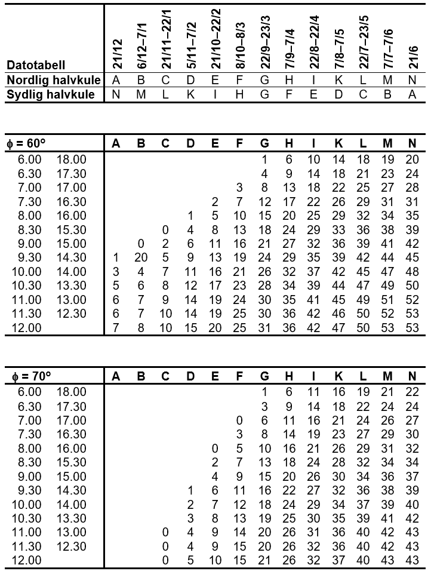
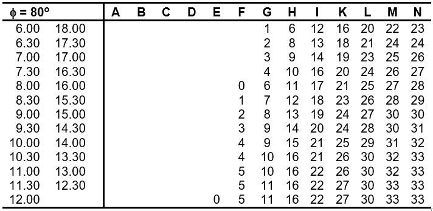

== Vedlegg A. (informativt) Solhøydetabell

[#imgSolhøyde1]
//[caption="Figure 15:"]
image::figurer/App_Solhøyde1.jpg[Solhøyde1,800,align="center"]

[#imgSolhøyde2]
//[caption="Figure 15:"]

[#imgSolhøyde3]
//[caption="Figure 15:"]

Eksempel: Man søker solhøyden 60^o^ nord den 7. september kl. 11.00. Av Datotabellen får man bokstaven H for 7. september, nordlig halvkule.For 60^o^ nord, bokstav H og klokkeslett 11.00, får man da en solhøyde lik 35^o^.
